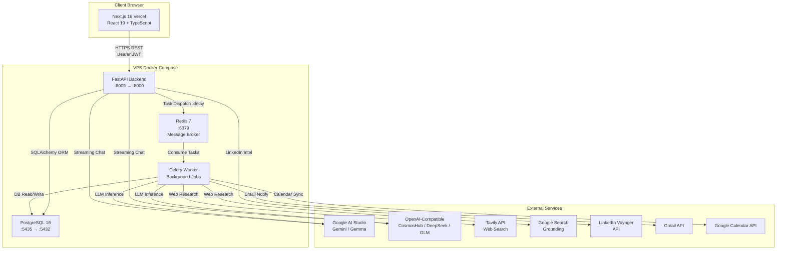
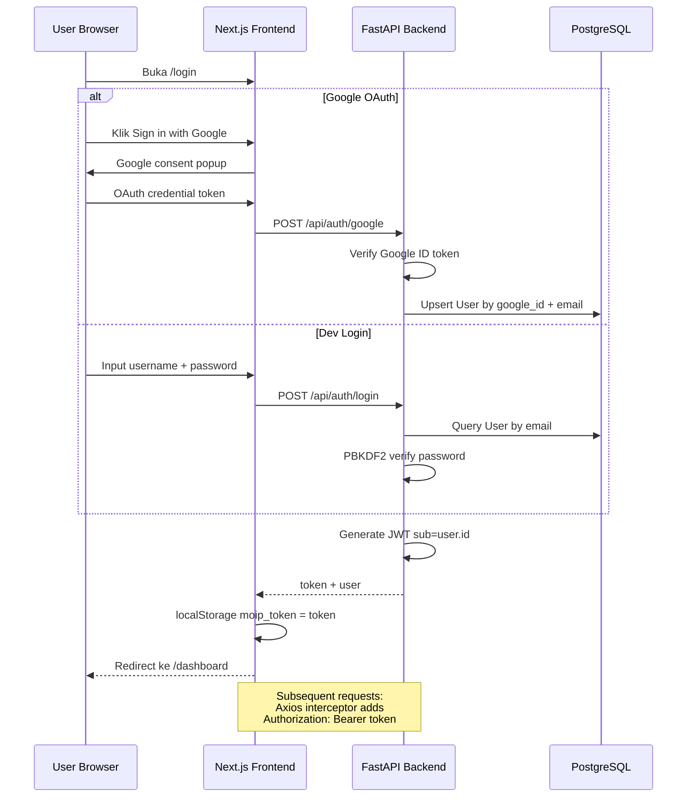
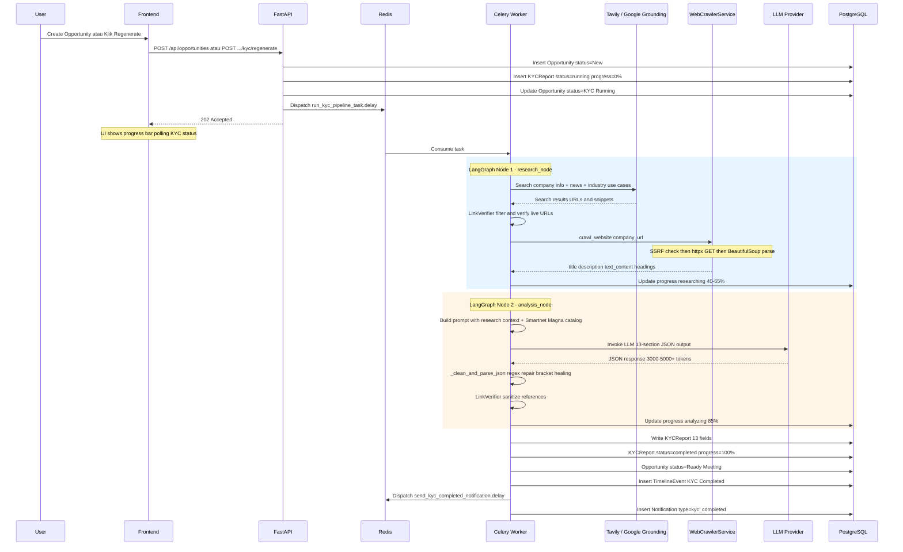
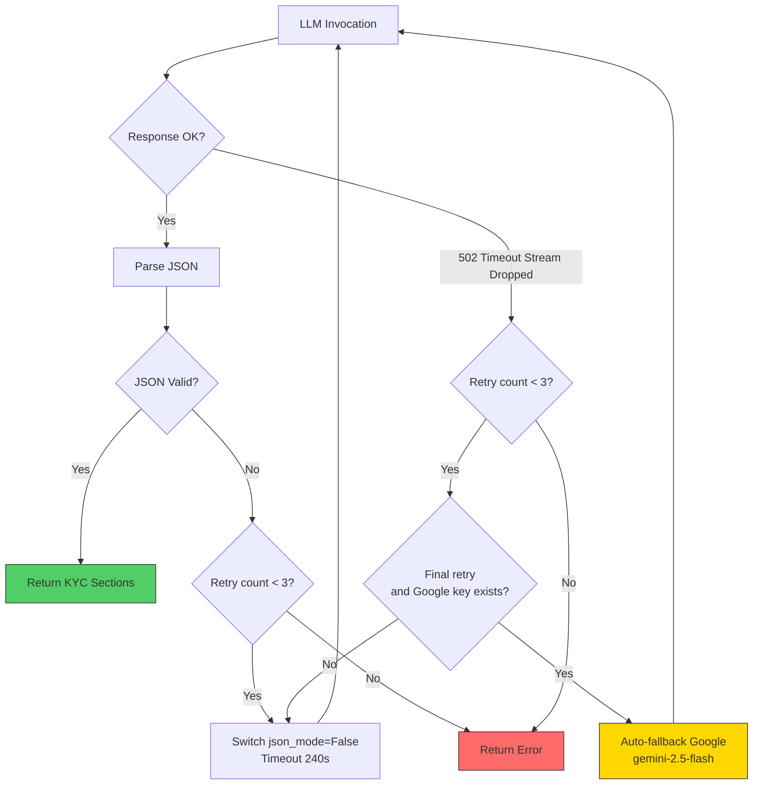
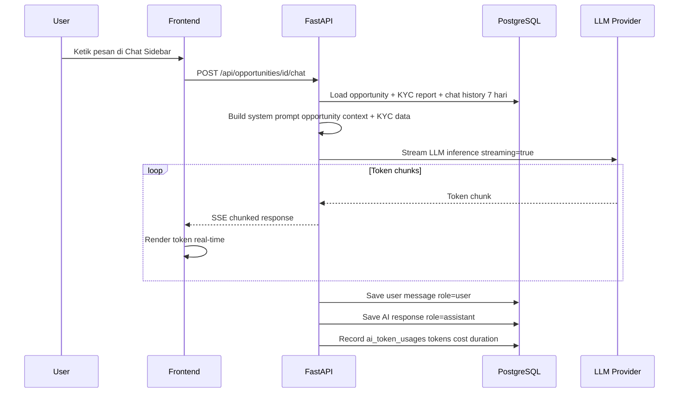
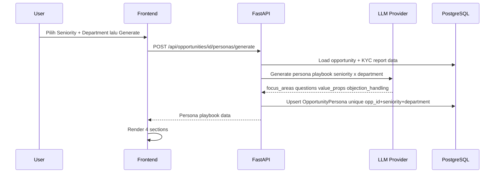
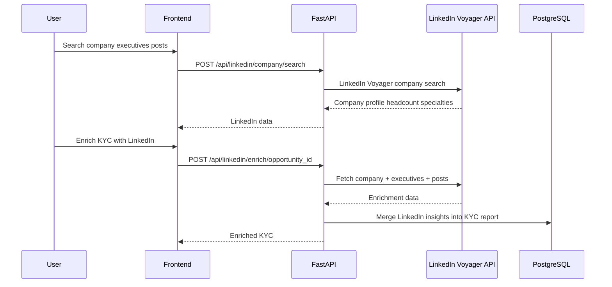
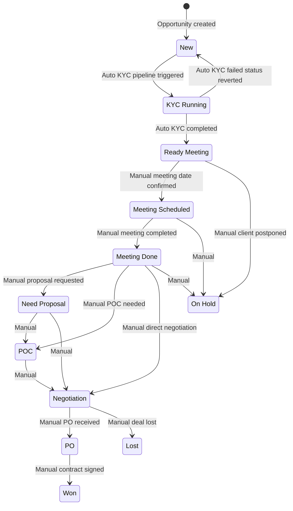
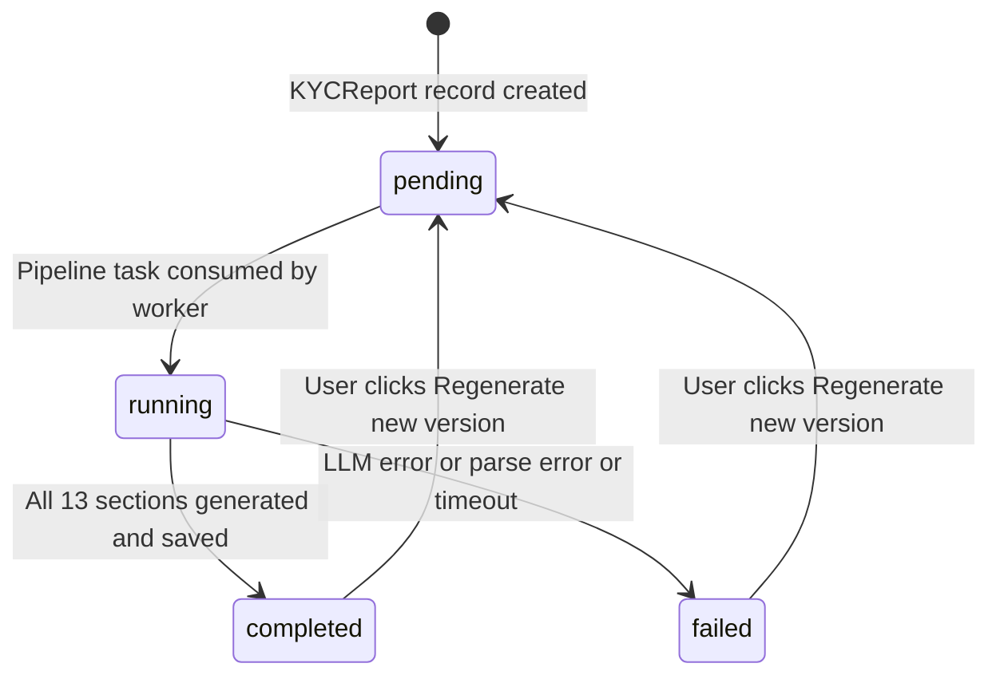
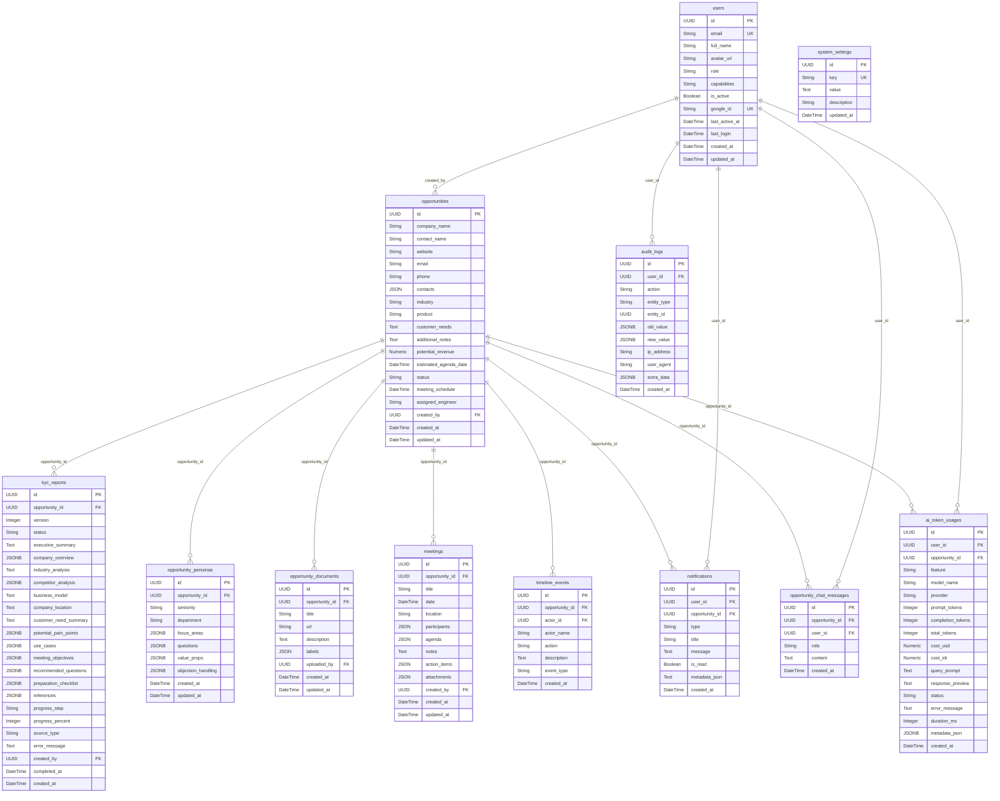

# MOIP Technical Architecture & System Design

> Dokumen arsitektur teknikal untuk **Magna Opportunity Intelligence Platform (MOIP)** — AI-powered pre-sales intelligence system milik PT Smartnet Magna Global. Terpisah dari [MOIP_USER_MANUAL.md](./MOIP_USER_MANUAL.md) (panduan end-user) dan [AI_CONTEXT.md](./AI_CONTEXT.md) (referensi cepat AI assistant).

---

## Daftar Isi

1. [Overview Arsitektur & Topology](#1-overview-arsitektur--topology)
2. [Tech Stack & Komponen](#2-tech-stack--komponen)
3. [Sequence Diagram & Flow Aplikasi](#3-sequence-diagram--flow-aplikasi)
4. [State Machine & Lifecycle](#4-state-machine--lifecycle)
5. [Database Schema & Relasi (ERD)](#5-database-schema--relasi-erd)
6. [Keamanan, RBAC & Capabilities](#6-keamanan-rbac--capabilities)
7. [Arsitektur AI Engine & RAG Strategy](#7-arsitektur-ai-engine--rag-strategy)
8. [Arsitektur Deployment & Infrastruktur](#8-arsitektur-deployment--infrastruktur)
9. [Katalog API Endpoints](#9-katalog-api-endpoints)

---

## 1. Overview Arsitektur & Topology

MOIP menggunakan arsitektur **decoupled frontend-backend** dengan async task queue untuk operasi AI yang berat.



### Batasan Arsitektur

| Boundary | Komponen | Lokasi |
|----------|----------|--------|
| **Frontend** | Next.js 16 (App Router) | Vercel (auto-deploy dari `main`) |
| **API Gateway** | FastAPI + Uvicorn | Docker container di VPS |
| **Worker** | Celery (Python) | Docker container di VPS |
| **Data Store** | PostgreSQL 16 + Redis 7 | Docker containers di VPS |
| **AI Providers** | Google AI Studio, OpenAI-compatible | External cloud APIs |
| **Search Providers** | Tavily, Google Search Grounding | External APIs (switchable via DB) |

---

## 2. Tech Stack & Komponen

### Frontend

| Kategori | Teknologi | Detail |
|----------|-----------|--------|
| Framework | Next.js (App Router) | v16 |
| UI Library | React | v19 |
| Language | TypeScript | Strict mode |
| Styling | Tailwind CSS + shadcn/ui | Utility-first + headless components |
| State / Data Fetching | TanStack Query (React Query) | Server state caching & mutations |
| Forms | React Hook Form + Zod | Schema-based validation |
| Charts | Recharts | Dashboard visualizations |
| Drag & Drop | @hello-pangea/dnd | Kanban board |
| Notifications | Sonner | Toast notifications |
| Theming | next-themes | Dark/light mode persistence |
| i18n | Custom React Context | `locales/en.ts`, `locales/id.ts` |

### Backend

| Kategori | Teknologi | Detail |
|----------|-----------|--------|
| Framework | FastAPI | Python 3.11+, async |
| ORM | SQLAlchemy 2.0 | Mapped columns, UUID primary keys |
| Migrations | Alembic | Auto-upgrade on container start |
| Database | PostgreSQL 16 | Alpine image, JSONB columns |
| Task Queue | Celery 5+ | Redis 7 as broker |
| AI Orchestration | LangGraph + LangChain | StateGraph 2-node pipeline |
| Web Crawling | httpx + BeautifulSoup4 | Async HTTP + HTML parsing |
| Web Search | Tavily API + Google Grounding | Switchable via `system_settings` |
| LinkedIn | LinkedIn Voyager API client | Company/executive/post intelligence |
| Auth | Google OAuth 2.0 + Dev login | JWT Bearer tokens |
| Password Hashing | PBKDF2-HMAC-SHA256 | 100k iterations, random salt |

### LLM Integration — Dual Provider via `app/core/llm.py`

```
┌────────────────────────────────────────────────────────┐
│              Unified LLM Factory: get_chat_llm()       │
│                                                        │
│  ┌──────────────────┐    ┌───────────────────────────┐ │
│  │  Google Provider  │    │  OpenAI-Compatible        │ │
│  │  gemini-2.5-flash│    │  glm-4-plus (default)     │ │
│  │  gemma-4-26b-a4b │    │  deepseek-*, gpt-*        │ │
│  │  langchain-      │    │  langchain-openai          │ │
│  │  google-genai    │    │  base: cosmoshub.tech/v1   │ │
│  └──────────────────┘    └───────────────────────────┘ │
│                                                        │
│  Runtime switchable via DB table system_settings       │
│  Keys: llm_provider, ai_model, temperature,           │
│         gemini_api_key, openai_api_key, openai_api_base│
└────────────────────────────────────────────────────────┘
```


---

## 3. Sequence Diagram & Flow Aplikasi

### 3.1 Authentication Flow



### 3.2 KYC Pipeline Flow — Async Celery + LangGraph




### 3.3 LLM Resilience & Fallback Flow



**Strategi Resilience:**

| Strategi | Detail |
|----------|--------|
| Client timeout | 180s–240s di `get_chat_llm()` |
| Reasoning model guard | Auto-strip `response_format` JSON untuk model R1, o1, o3, QWQ |
| Retry loop | Max 3 attempts, exponential backoff 2s–6s |
| JSON self-healing | Regex fence extraction, trailing comma cleanup, bracket balancing |
| Provider fallback | Final retry auto-switch ke `gemini-2.5-flash` jika OpenAI gagal |

### 3.4 AI Chat Streaming Flow



### 3.5 Target Persona Generation Flow



### 3.6 LinkedIn Intelligence & KYC Enrichment Flow




---

## 4. State Machine & Lifecycle

### 4.1 Opportunity Status Lifecycle



### 4.2 KYC Report Status Lifecycle



**KYC Progress Steps:**

| Step | Percent | Keterangan |
|------|---------|------------|
| `pending` | 0% | Record dibuat, menunggu worker |
| `fetching_web` | 40% | Web search + crawling aktif |
| `fetching_industry` | 65% | Industry use case search |
| `analyzing` | 85% | LLM inference sedang berjalan |
| `completed` | 100% | Semua section tersimpan |
| `failed` | — | Error, dengan pesan di `error_message` |


---

## 5. Database Schema & Relasi (ERD)

### 5.1 Entity-Relationship Diagram




### 5.2 Tabel & Model

| # | Tabel | Model SQLAlchemy | JSONB Columns |
|---|-------|------------------|---------------|
| 1 | `users` | `User` | — |
| 2 | `opportunities` | `Opportunity` | `contacts` (JSON) |
| 3 | `kyc_reports` | `KYCReport` | `company_overview`, `competitor_analysis`, `potential_pain_points`, `use_cases`, `meeting_objectives`, `recommended_questions`, `preparation_checklist`, `references` |
| 4 | `opportunity_personas` | `OpportunityPersona` | `focus_areas`, `questions`, `value_props`, `objection_handling` |
| 5 | `opportunity_documents` | `OpportunityDocument` | `labels` (JSON) |
| 6 | `meetings` | `Meeting` | `participants`, `agenda`, `action_items`, `attachments` (JSON) |
| 7 | `timeline_events` | `TimelineEvent` | — |
| 8 | `opportunity_chat_messages` | `OpportunityChatMessage` | — |
| 9 | `notifications` | `Notification` | — |
| 10 | `ai_token_usages` | `AITokenUsage` | `metadata_json` |
| 11 | `audit_logs` | `AuditLog` | `old_value`, `new_value`, `extra_data` |
| 12 | `system_settings` | `SystemSetting` | — |

### 5.3 Unique Constraints & Indexes

| Tabel | Constraint / Index | Kolom |
|-------|-------------------|-------|
| `users` | Unique | `email`, `google_id` |
| `users` | Index | `email`, `last_active_at` |
| `opportunity_personas` | Unique | `(opportunity_id, seniority, department)` |
| `ai_token_usages` | Index | `created_at`, `user_id`, `opportunity_id`, `feature`, `model_name` |
| `audit_logs` | Index | `(entity_type, entity_id)`, `user_id`, `created_at`, `action` |
| `system_settings` | Unique + Index | `key` |


---

## 6. Keamanan, RBAC & Capabilities

### 6.1 Authentication

```
┌──────────────────────────────────────────────────────┐
│ JWT Bearer Token Authentication                      │
│                                                      │
│ 1. Login → POST /api/auth/google or /api/auth/login  │
│ 2. Backend generates JWT sub=user.id                 │
│ 3. Frontend: localStorage moip_token                 │
│ 4. Axios interceptor: Authorization: Bearer token    │
│ 5. FastAPI: HTTPBearer → decode JWT → query User     │
│ 6. Check user.is_active == true                      │
└──────────────────────────────────────────────────────┘
```

### 6.2 Dual-Tier Permission Model

MOIP menggunakan **role** (label identitas) + **capabilities** (izin aksi) sebagai dua lapisan independen.

**Identity Roles:**

| Role | Deskripsi |
|------|-----------|
| `admin` | Administrative access |
| `lead_gen` | Lead Generation Officer |
| `managerial` | Manager / team lead |
| `engineer` | Pre-sales engineer |
| `presales` | Pre-sales role |
| `viewer` | Read-only (default untuk user baru) |

> Untuk perubahan role atau kapabilitas akun, hubungi **Nixon** atau **Robi**.

**Functional Capabilities** (comma-separated di kolom `users.capabilities`):

| Capability | Aksi |
|------------|------|
| `view` | Lihat dashboard, opportunity, KYC report |
| `create_edit` | Buat/edit opportunity, meeting, dokumen |
| `delete` | Hapus opportunity, meeting |
| `generate_kyc` | Trigger/regenerate KYC AI + persona |
| `user_management` | Kelola user di panel Settings |

**Enforcement di Backend:**

```python
# Capability check via dependency injection
@router.post("/")
async def create_opportunity(
    user: User = Depends(require_capability("create_edit"))
): ...

# Admin-only endpoint
@router.get("/settings")
async def get_settings(
    user: User = Depends(require_admin)
): ...
```

### 6.3 SSRF Protection — Web Crawler

`WebCrawlerService._is_safe_url()` memblokir URL yang resolve ke:

| Blocked Range | Alasan |
|---------------|--------|
| Private IP (RFC 1918) | `10.0.0.0/8`, `172.16.0.0/12`, `192.168.0.0/16` |
| Loopback | `127.0.0.0/8` |
| Link-local | `169.254.0.0/16` (termasuk GCP metadata `169.254.169.254`) |
| Multicast | `224.0.0.0/4` |
| Reserved | IANA reserved ranges |

Implementasi: `socket.gethostbyname()` → `ipaddress.ip_address()` → check `.is_private`, `.is_loopback`, `.is_link_local`, `.is_multicast`, `.is_reserved`.


---

## 7. Arsitektur AI Engine & RAG Strategy

### 7.1 KYC Pipeline — LangGraph 2-Node StateGraph

```
┌────────────────────────────────────────────────────────────────┐
│                   LangGraph StateGraph                         │
│                                                                │
│  ┌──────────────┐         ┌──────────────┐                    │
│  │ research_node│────────►│ analysis_node│────────► END        │
│  │              │         │              │                    │
│  │ Tavily search│         │ Build prompt │                    │
│  │ Google       │         │ Inject       │                    │
│  │  Grounding   │         │  Smartnet    │                    │
│  │ Website      │         │  Magna       │                    │
│  │  crawling    │         │  catalog     │                    │
│  │ Link         │         │ LLM → 13    │                    │
│  │  verifier    │         │  JSON        │                    │
│  │              │         │  sections    │                    │
│  └──────────────┘         └──────────────┘                    │
│                                                                │
│  State: KYCState (TypedDict)                                   │
│  Input: company_name, website, industry, customer_needs, etc.  │
│  Output: 13 KYC sections + references                          │
└────────────────────────────────────────────────────────────────┘
```

### 7.2 RAG Strategy: Prompt Context Injection

MOIP **tidak menggunakan vector database** di produksi. Strategi RAG:

1. **Smartnet Magna Solutions Catalog** — hardcoded dalam prompt KYC pipeline sebagai inline context. 5 kategori solusi: GCP Infra, Data & AI, Cybersecurity, Network, Managed Services.
2. **Live Web Data** — Tavily search + Google Search Grounding menghasilkan snippets dan citations yang di-inject sebagai research context.
3. **Website Content** — Crawled via `httpx` + `BeautifulSoup4`, dimuat langsung ke prompt.
4. **Opportunity Context** — Data opportunity + KYC report di-inject ke system prompt untuk AI Chat.

### 7.3 KYC Output Sections — 13 bagian

| # | Field | Type | Deskripsi |
|---|-------|------|-----------|
| 1 | `executive_summary` | Text | Ringkasan eksekutif 2-3 paragraf |
| 2 | `company_overview` | JSONB | Profil: lokasi, karyawan, tahun, deskripsi |
| 3 | `industry_analysis` | Text | Tren dan tantangan industri |
| 4 | `competitor_analysis` | JSONB | Kompetitor + diferensiasi SMG |
| 5 | `business_model` | Text | Model bisnis dan revenue klien |
| 6 | `company_location` | Text | Lokasi perusahaan |
| 7 | `customer_need_summary` | Text | Rangkuman kebutuhan |
| 8 | `potential_pain_points` | JSONB | Pain points klien |
| 9 | `use_cases` | JSONB | Use case + solusi SMG + Google Cloud + impact level |
| 10 | `meeting_objectives` | JSONB | Tujuan rapat |
| 11 | `recommended_questions` | JSONB | Pertanyaan discovery |
| 12 | `preparation_checklist` | JSONB | Checklist persiapan |
| 13 | `references` | JSONB | URL sumber verified via LinkVerifier |

### 7.4 JSON Self-Healing Pipeline

LLM output sering mengandung defect. `_clean_and_parse_json()` menangani:

1. Extract JSON dari markdown code fence
2. Slice dari `{` pertama
3. Clean trailing commas (`, }` → `}`, `, ]` → `]`)
4. Standard `json.loads()` pada substring balanced
5. Escape unescaped newlines/tabs dalam string
6. **Structural repair**: scan karakter, track `in_string` + bracket stack, close open quotes/brackets


---

## 8. Arsitektur Deployment & Infrastruktur

### 8.1 Deployment Topology

```
┌─────────────────────────────────┐
│         Vercel (Cloud)          │
│                                 │
│  Next.js 16 Frontend            │
│  Auto-deploy on push to main    │
│  NEXT_PUBLIC_API_URL → VPS      │
└───────────┬─────────────────────┘
            │ HTTPS
            ▼
┌─────────────────────────────────────────────────┐
│              VPS Self-Hosted                     │
│              Docker Compose                      │
│                                                  │
│  ┌──────────────┐  ┌───────────┐  ┌──────────┐  │
│  │   backend    │  │  celery   │  │ postgres │  │
│  │  FastAPI     │  │  Worker   │  │   16     │  │
│  │  :8009→:8000 │  │           │  │:5435→5432│  │
│  └──────┬───────┘  └─────┬─────┘  └──────────┘  │
│         │                │                       │
│         └──────┬─────────┘                       │
│                ▼                                 │
│         ┌──────────┐                             │
│         │  redis 7 │                             │
│         │  :6379   │                             │
│         └──────────┘                             │
└─────────────────────────────────────────────────┘
```

### 8.2 Docker Services

| Service | Image | Port Mapping | Startup Command |
|---------|-------|-------------|-----------------|
| `postgres` | `postgres:16-alpine` | `127.0.0.1:5435 → 5432` | Default PostgreSQL |
| `redis` | `redis:7-alpine` | `127.0.0.1:6379 → 6379` | Default Redis |
| `backend` | Python 3.11 (custom) | `8009 → 8000` | `alembic upgrade head && uvicorn app.main:app --host 0.0.0.0 --port 8000` |
| `celery` | Python 3.11 (custom) | — | `celery -A app.core.celery_app worker --loglevel=info` |
| `frontend` | Node 20 (custom) | `3009 → 3000` | **Production: Vercel** — Docker hanya untuk local dev |

### 8.3 Environment Variables

| Variable | Service | Deskripsi |
|----------|---------|-----------|
| `DATABASE_URL` | backend, celery | PostgreSQL connection string |
| `SECRET_KEY` | backend | JWT signing secret |
| `REDIS_URL` | backend, celery | Redis broker URL |
| `GOOGLE_CLIENT_ID` | backend, frontend | Google OAuth client ID |
| `GOOGLE_CLIENT_SECRET` | backend | Google OAuth secret |
| `GOOGLE_WORKSPACE_DOMAIN` | backend | Allowed domain `magnaglobal.id` |
| `LLM_PROVIDER` | backend, celery | Default LLM provider google or openai |
| `GEMINI_API_KEY` / `GOOGLE_API_KEY` | backend, celery | Google AI Studio key |
| `GEMINI_MODEL` | backend, celery | Default Gemini model |
| `OPENAI_API_KEY` | backend, celery | OpenAI-compatible API key |
| `OPENAI_API_BASE` | backend, celery | OpenAI-compatible base URL |
| `OPENAI_MODEL` | backend, celery | Default OpenAI model |
| `TAVILY_API_KEY` | backend, celery | Tavily search API key |
| `FRONTEND_URL` | backend | CORS allowed origin |
| `NEXT_PUBLIC_API_URL` | frontend | Backend API base URL |

### 8.4 Deploy Commands

```bash
# Backend only (production VPS)
docker compose build --no-cache backend celery
docker compose up -d backend celery

# Migrations dijalankan otomatis saat backend container start
# Manual jika perlu:
docker compose exec -T backend alembic upgrade head
```


---

## 9. Katalog API Endpoints

### System

| Method | Path | Auth | Deskripsi |
|--------|------|------|-----------|
| GET | `/api/health` | No | Health check |
| GET | `/api/config` | No | Public config google_client_id |

### Auth — `/api/auth`

| Method | Path | Auth | Deskripsi |
|--------|------|------|-----------|
| POST | `/google` | No | Google OAuth login |
| POST | `/login` | No | Dev username/password login |
| GET | `/me` | Yes | Current user profile |

### Users — `/api/users`

| Method | Path | Auth | Deskripsi |
|--------|------|------|-----------|
| GET | `/` | Yes | List active users, optional role filter |

### Opportunities — `/api/opportunities`

| Method | Path | Auth | Deskripsi |
|--------|------|------|-----------|
| GET | `/` | Yes | List paginated, filterable by status/search/engineer_id |
| POST | `/` | Yes | Create opportunity, triggers KYC |
| POST | `/import` | create_edit | Bulk import CSV/Excel |
| GET | `/search/global` | Yes | Global search |
| GET | `/{id}` | Yes | Opportunity detail |
| PATCH | `/{id}` | Yes | Update opportunity |
| DELETE | `/{id}` | Yes | Delete opportunity |
| GET | `/{id}/chat` | Yes | Chat history |
| POST | `/{id}/chat` | Yes | AI chat streaming |
| GET | `/{id}/documents` | Yes | List documents |
| POST | `/{id}/documents` | Yes | Add document |
| PATCH | `/{id}/documents/{doc_id}` | Yes | Update document |
| DELETE | `/{id}/documents/{doc_id}` | Yes | Delete document |

### Personas — `/api/opportunities/{id}/personas`

| Method | Path | Auth | Deskripsi |
|--------|------|------|-----------|
| GET | `/` | Yes | List saved personas |
| GET | `/detail` | Yes | Get playbook by seniority+department query params |
| POST | `/generate` | Yes | Generate persona |

### KYC — `/api/opportunities/{id}/kyc`

| Method | Path | Auth | Deskripsi |
|--------|------|------|-----------|
| GET | `/` | Yes | Latest KYC report |
| GET | `/versions` | Yes | Version history |
| GET | `/{report_id}` | Yes | Specific report |
| POST | `/regenerate` | Yes | Trigger regeneration 202 Accepted |
| PATCH | `/{report_id}` | Yes | Edit KYC report |

### Meetings — `/api/meetings`

| Method | Path | Auth | Deskripsi |
|--------|------|------|-----------|
| GET | `/` | Yes | List meetings |
| POST | `/` | Yes | Create meeting |
| GET | `/{id}` | Yes | Meeting detail |
| PUT | `/{id}` | Yes | Update meeting |
| DELETE | `/{id}` | Yes | Delete meeting |

### Notifications — `/api/notifications`

| Method | Path | Auth | Deskripsi |
|--------|------|------|-----------|
| GET | `/` | Yes | List paginated |
| GET | `/unread-count` | Yes | Unread count |
| PATCH | `/{id}` | Yes | Mark read/unread |
| POST | `/mark-all-read` | Yes | Mark all read |

### AI Validation — `/api/ai`

| Method | Path | Auth | Deskripsi |
|--------|------|------|-----------|
| POST | `/validate` | Yes | Validate AI output + URL veracity |

### LinkedIn — `/api/linkedin`

| Method | Path | Auth | Deskripsi |
|--------|------|------|-----------|
| POST | `/company/search` | Yes | Search company |
| POST | `/company/posts` | Yes | Company posts |
| POST | `/company/executives` | Yes | Key executives |
| POST | `/company/people` | Yes | Employee search |
| POST | `/person/profile` | Yes | Person profile |
| POST | `/enrich/{id}` | Yes | Enrich KYC with LinkedIn |

### Admin — `/api/admin`

| Method | Path | Auth | Deskripsi |
|--------|------|------|-----------|
| GET | `/metrics` | Admin | System metrics |
| GET | `/logs` | Admin | Audit logs |
| GET | `/users` | Admin | User list + telemetry |
| GET | `/users/{id}/activity` | Admin | User activity trail |
| PATCH | `/users/{id}` | Admin | Update user role/capabilities |
| GET | `/master-data` | Admin | Master data options |
| POST | `/master-data` | Admin | Update master data |
| GET | `/settings` | Admin | System settings |
| PATCH | `/settings` | Admin | Update settings |
| POST | `/settings/test-connection` | Admin | Test LLM API key |
| GET | `/ai/metrics` | Admin | AI token usage summary |
| GET | `/ai/usage/by-opportunity` | Admin | AI cost per opportunity |
| GET | `/ai/usage/by-user` | Admin | AI cost per user |
| GET | `/ai/assistant-queries` | Admin | Prompt audit log |

### Dashboard — `/api/dashboard`

| Method | Path | Auth | Deskripsi |
|--------|------|------|-----------|
| GET | `/metrics` | Yes | KPIs, status, trend, recent, upcoming meetings |

Filter params: `status`, `engineer_name`, `date_from`, `date_to`


---

## Backend Services Map

```
backend/app/
├── main.py                          # FastAPI app, CORS, middleware, router includes
├── tasks.py                         # Celery tasks (notifications, KYC runner, reminders)
├── core/
│   ├── config.py                    # Settings (env vars, defaults)
│   ├── database.py                  # SQLAlchemy engine, SessionLocal, Base
│   ├── llm.py                       # Unified LLM Factory (get_chat_llm)
│   ├── celery_app.py                # Celery config with Redis broker
│   ├── security.py                  # JWT auth, get_current_user, require_capability
│   └── error_handler.py             # Global error handler middleware
├── models/                          # SQLAlchemy ORM models (12 tables)
├── schemas/                         # Pydantic request/response schemas
├── api/                             # FastAPI routers (12 route modules)
│   ├── auth.py, users.py, opportunities.py, meetings.py
│   ├── notifications.py, kyc.py, dashboard.py, admin.py
│   ├── linkedin.py, personas.py, ai_validation.py
│   └── ...
└── services/                        # Business logic & external integrations
    ├── kyc_pipeline.py              # LangGraph 2-node KYC pipeline
    ├── persona_service.py           # Persona playbook generation
    ├── web_search_service.py        # Tavily / Google Grounding search
    ├── web_crawler_service.py       # httpx + BS4 crawler (SSRF protected)
    ├── google_grounding_service.py  # Google Search Grounding via native SDK
    ├── linkedin_service.py          # LinkedIn Voyager API client
    ├── ai_validation_service.py     # AI output factuality validation
    ├── ai_usage_service.py          # Token tracking & cost calculation
    ├── link_verifier.py             # Concurrent URL accessibility checker
    ├── audit_service.py             # Entity change audit logging
    ├── auth.py                      # JWT encode/decode, Google token verify
    ├── email_service.py             # Gmail API email sender
    └── calendar_service.py          # Google Calendar API integration
```

## Frontend Structure Map

```
frontend/src/
├── app/                             # Next.js App Router
│   ├── layout.tsx                   # Root layout (providers)
│   ├── page.tsx                     # Root redirect
│   ├── login/page.tsx               # Login page
│   └── (main)/                      # Authenticated layout group
│       ├── layout.tsx               # Sidebar + TopNav
│       ├── dashboard/page.tsx
│       ├── opportunities/
│       │   ├── page.tsx             # List (Kanban + Table views)
│       │   ├── create/page.tsx
│       │   └── [id]/page.tsx        # Detail (tabbed: Overview, KYC, Persona, etc.)
│       ├── meetings/page.tsx
│       ├── notifications/page.tsx
│       └── settings/page.tsx        # Admin: User mgmt, Master data, AI settings
├── components/
│   ├── ui/                          # shadcn/ui primitives
│   ├── layout/                      # Sidebar, TopNav, ThemeToggle, LanguageToggle
│   ├── providers/                   # ThemeProvider, QueryProvider, AuthProvider
│   ├── shared/                      # StatusBadge
│   └── domains/
│       ├── dashboard/               # Metrics, charts (Status, Trend, Funnel, etc.)
│       ├── opportunities/           # ChatSidebar, EditDialog, Kanban components
│       ├── kyc/                     # KYCReportTab, EditForm, VersionSelector
│       ├── personas/                # TargetPersonaTab
│       ├── documents/               # ResourcesTab, AddDocumentDialog
│       ├── meetings/                # Accordion, Create/Edit dialogs
│       ├── admin/                   # UserActivityDrawer, AITokenMonitoringTab
│       └── notifications/           # NotificationDropdown
├── hooks/                           # React Query hooks (opportunities, kyc, meetings, etc.)
├── lib/                             # API clients, utilities, clipboard, error handling
├── types/                           # TypeScript type definitions
├── context/                         # LanguageContext
└── locales/                         # en.ts, id.ts translation dictionaries
```

---

*Dokumen ini terakhir diperbarui: 2026-09-09*
*Source of truth: codebase aktual di `backend/app/` dan `frontend/src/`*

