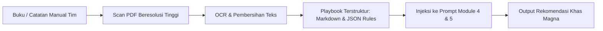

# Blueprint Implementasi Masa Depan (Future Implementation Roadmap)
> **Dokumen Arsitektur & Panduan Pengembangan Lanjutan MOIP**  
> **Status**: Approved for Roadmap | **Target Model Utama**: Google Gemini (Gemini 3.8 Flash & text-embedding-004)

Dokumen ini merangkum rencana arsitektur dan peningkatan strategis untuk platform **Magna Opportunity Intelligence Platform (MOIP)** berdasarkan evaluasi teknis, feedback senior konsultan, dan hasil benchmark multi-model.

---

## Daftar Isi
1. [Inisiatif 1: Generation by Section & Native Structured Output (Implemented)](#inisiatif-1-generation-by-section--native-structured-output)
2. [Inisiatif 2: Penyempurnaan Target Personas (UX & Schema)](#inisiatif-2-penyempurnaan-target-personas-ux--schema)
3. [Inisiatif 3: RAG & Vector Embeddings untuk Magna Solutions Catalog](#inisiatif-3-rag--vector-embeddings-untuk-magna-solutions-catalog)
4. [Inisiatif 4: Restrukturisasi Hirarki Entitas (Company/Account → Multi-Opportunity Folder Model)](#inisiatif-4-restrukturisasi-hirarki-entitas-companyaccount--multi-opportunity-folder-model)
5. [Inisiatif 5: Living Opportunity Lifecycle & MoM-Driven Progressive Intelligence](#inisiatif-5-living-opportunity-lifecycle--mom-driven-progressive-intelligence)
6. [Inisiatif 6: Digitalisasi Internal Sales Playbook & "How-to" Presales Framework](#inisiatif-6-digitalisasi-internal-sales-playbook--how-to-presales-framework)
7. [Inisiatif 7: Katalog Produk Terstruktur & Analisis Pragmatis (RAG Vector vs. Metadata Filtering)](#inisiatif-7-katalog-produk-terstruktur--analisis-pragmatis-rag-vector-vs-metadata-filtering)
8. [Inisiatif 8: Direktori Stakeholder & Multi-Contact Mapping (Company People Directory)](#inisiatif-8-direktori-stakeholder--multi-contact-mapping-company-people-directory)
9. [Rencana Fase Eksekusi & Prioritas](#rencana-fase-eksekusi--prioritas)
10. [Master Checklist Implementasi](#master-checklist-implementasi)

---

## Inisiatif 1: Generation by Section & Native Structured Output

### 1.1 Latar Belakang Masalah (Kenapa Perlu Diubah?)
Saat ini, pembuatan laporan KYC dilakukan dalam **satu panggilan LLM monolitik (*single brutal prompt*)**:
- LLM dipaksa menghasilkan seluruh 12 section sekaligus (Executive Summary, Company Overview, Industry Analysis, Competitors, Business Model, Customer Needs, Pain Points, 3 Solusi/Use Cases detail, Meeting Objectives, Questions, Checklist, dan References).
- **Kelemahan Monolitik**:
  1. *Attention Decay*: LLM cenderung dangkal pada bagian tengah atau akhir karena beban instruksi yang terlalu padat dalam satu prompt.
  2. *Brittle JSON Parsing*: Mengandalkan regex pembersih teks (`_clean_and_parse_json`) yang rawan *syntax error* atau terpotong (*truncated*) jika output panjang.
  3. *Sulit Fine-Tuning Per Section*: Tidak bisa memberikan instruksi mendalam (misal: analisis finansial khusus perbankan) tanpa membuat prompt utama membengkak.

### 1.2 Apa itu "Structured Output"?
**Structured Output** adalah fitur mutakhir dari provider AI modern (Google Gemini API & OpenAI) yang menjamin **100% output mematuhi skema JSON (Pydantic Schema)** pada level decoding token:
- Model **tidak akan pernah** menghasilkan JSON rusak, kurung kurawal terpotong, atau markdown pengantar yang tidak diinginkan.
- Di LangChain: menggunakan metode `llm.with_structured_output(PydanticModel)`.
- Di Google GenAI SDK: menggunakan konfigurasi native `generation_config={"response_mime_type": "application/json", "response_schema": PydanticModel}`.
- **Dampaknya**: Seluruh fungsi regex *self-healing* yang rumit dapat dihapus total, dan integritas data API dijamin 100% konsisten.

### 1.3 Arsitektur *Sectional Generation Pipeline* (LangGraph / Asynchronous Modular)
Laporan KYC dipecah menjadi beberapa node generasi modular yang dapat berjalan secara independen atau paralel:

```mermaid
graph TD
    Start[Input Opportunity Data & Research Context] --> Branch
    
### 1.3 Arsitektur *Sectional Generation Pipeline* & Granular Auto-Retry

#### A. Urutan Alur Generasi: *Executive Summary* sebagai Sintesis Terakhir
Dalam praktik konsultan bisnis enterprise, **Executive Summary selalu ditulis paling akhir**. Executive Summary yang bernilai tinggi bukan sekadar ringkasan profil perusahaan, melainkan sintesis strategis yang merangkum:
1. Konteks bisnis dan posisi industri klien.
2. Akar permasalahan teknis (*pain points*) yang mendesak.
3. Rekap portofolio solusi SMG yang diajukan beserta justifikasi arsitekturnya.
4. Urgensi bisnis dan target pencapaian pada meeting presales mendatang.

Oleh karena itu, alur eksekusi generasi dibagi menjadi 3 fase bertingkat:

```mermaid
graph TD
    Start[Input Opportunity Data & Research Context] --> Phase1
    
    subgraph Phase 1: Analisis Fondasi (Paralel)
        Phase1[Dispatcher Stage 1] --> SecA[1. Profil & Model Bisnis Perusahaan]
        Phase1 --> SecB[2. Lanskap Industri & Analisis Kompetitor]
        Phase1 --> SecC[3. Customer Needs & Operational Pain Points]
    end

    subgraph Phase 2: Solusi Teknis & Eksekusi Presales (Paralel)
        SecC --> Phase2[Dispatcher Stage 2]
        Phase2 --> SecD[4. Arsitektur Solusi SMG & Presales Use Cases]
        Phase2 --> SecE[5. Meeting Objectives, Discovery Questions & Checklist]
    end

    subgraph Phase 3: Sintesis Akhir (Executive Synthesis)
        SecA & SecB & SecD & SecE --> SecFinal[6. Executive Summary Terintegrasi]
    end

    SecFinal --> AtomicCheck{Semua Section Berhasil?}
    AtomicCheck -- Ya --> FinalJSON[Commit ke Database & Tampilkan di Frontend]
    AtomicCheck -- Gagal di Bagian Tertentu --> SectionRetry[Auto-Retry Hanya Section yang Gagal]
    SectionRetry --> AtomicCheck
```

#### B. Granular Fault-Tolerance & Section-Level Auto-Retry
- **Masalah pada Pipeline Monolitik**: Jika satu prompt 12-section mengalami timeout atau *rate limit* di detik ke-40, seluruh proses gagal dan harus diulang dari awal (buang token dan waktu).
- **Mekanisme Granular Auto-Retry per Section**:
  1. Setiap section dijalankan sebagai unit task independen dengan mekanisme *retry handler* (misal: 3x *exponential backoff*).
  2. Jika 5 section berhasil dan 1 section (misal: *Analisis Kompetitor*) mengalami kegagalan/timeout, sistem **HANYA me-retry section yang gagal tersebut**. Hasil 5 section lainnya tetap dipertahankan dalam memori/state.
  3. **Atomic UI Presentation Guarantee**: Meskipun proses di backend bersifat terpotong-potong per section, frontend **HANYA menampilkan laporan ketika 100% seluruh section telah berhasil diproses secara lengkap**. User tidak akan pernah melihat laporan yang setengah jadi atau *corrupted*.

#### C. Pembagian Modul Section:
1. **Module 1: Company Profile & Business Footprint** (`CompanyOverviewModel`, `BusinessModel`, `LocationModel`)
2. **Module 2: Industry Dynamics & Competitors** (`IndustryAnalysisModel`, `List[CompetitorModel]`)
3. **Module 3: Customer Pain Points & Latent Needs** (`CustomerNeedSummaryModel`, `List[PainPointModel]`)
4. **Module 4: Technical Architecture & Presales Use Cases** (`List[PresalesUseCaseModel]` - Grounding Hybrid RAG Solusi SMG)
5. **Module 5: Presales Engagement Strategy** (`MeetingStrategyModel` - Pertanyaan discovery per stakeholder & checklist)
6. **Module 6: Ultimate Executive Summary** (`ExecutiveSummaryModel` - Mengonsolidasikan Module 1 s/d 5 menjadi narasi C-Level yang kohesif)

---

## Inisiatif 3: RAG & Vector Embeddings untuk Magna Solutions Catalog

### 3.1 Transisi dari Lexical Search ke Hybrid RAG
Untuk mencegah *false positives* (seperti artikel rumah sakit masuk ke perbankan) sekaligus memastikan relevansi semantik tingkat tinggi saat katalog SMG bertambah besar:

```
                      [ Input Kebutuhan Klien ]
                                  │
                                  ▼
┌───────────────────────────────────────────────────────────────────┐
│ 1. Deterministic Metadata Filter (Hard Constraints)               │
│    - Industry Isolation: Exclude dokumen yang bertag eksklusif    │
│      industri lain (misal: Healthcare jika klien adalah Banking).  │
│    - Deployment Mode: Prioritaskan On-Premises jika klien         │
│      eksplisit meminta server lokal.                              │
└───────────────────────────────────────────────────────────────────┘
                                  │
                                  ▼  (Kandidat Dokumen Terfilter)
┌───────────────────────────────────────────────────────────────────┐
│ 2. Semantic Embedding Similarity (Gemini text-embedding-004)      │
│    - Query Embed: 1 call API ke text-embedding-004               │
│    - Compute Cosine Similarity terhadap Vektor Katalog SMG        │
│    - Ambil Top-K (misal Top 3) Solusi dengan skor tertinggi       │
└───────────────────────────────────────────────────────────────────┘
                                  │
                                  ▼
┌───────────────────────────────────────────────────────────────────┐
│ 3. LLM Generation (Gemini 3.8 Flash)                              │
│    - Menghasilkan rekomendasi use case arsitektural yang akurat   │
│      berdasarkan dokumen resmi terpilih                           │
└───────────────────────────────────────────────────────────────────┘
```

### 3.2 Standardisasi Ekosistem: Google Gemini
- **Generasi & Analisis**: `gemini-3.8-flash` (cepat, cerdas, context window besar, cost-effective).
- **Embedding Model**: `text-embedding-004` (model embedding resmi Google dengan dimensi 768, mendukung retrieval dokumen B2B dengan presisi tinggi).
- **Manajemen Kredensial**: Menggunakan `get_genai_client()` yang sudah ada di `backend/app/core/llm.py` via `GEMINI_API_KEY`.

### 3.3 Mekanisme Caching Vektor (Zero Extra Cost)
- Seluruh 46+ kartu solusi SMG dihitung vektor embedding-nya sekali saja (*pre-computed*).
- Vektor disimpan di file cache JSON lokal (`app/data/solution_embeddings.json`) atau tabel PostgreSQL dengan ekstensi `pgvector`.
- Saat runtime, proses retrieval **hanya melakukan 1 kali API call** untuk embedding query input klien, lalu menghitung *cosine similarity* di memori (< 1 milidetik).

### 3.4 Penambahan Solusi Resmi SMG yang Hilang
Katalog solusi resmi SMG wajib ditambahkan 2 kartu solusi strategis:
1. **On-Premise Enterprise Data Warehouse (EDW) with Greenplum Database (MPP Architecture)**
   - *Teknologi*: Greenplum Database (VMware Tanzu / Open Source MPP), Dell PowerEdge Server, Nutanix HCI, All-Flash NVMe Storage.
   - *Use Case*: Pengolahan data historis skala 10 TB - 100 TB+, pemrosesan query join kompleks antar ratusan tabel, Single Source of Truth on-premises.
2. **Microsoft SQL Server Modernization, Performance Tuning & Hybrid Data Mart**
   - *Teknologi*: Microsoft SQL Server Enterprise, Clustered Columnstore Indexing, In-Memory OLTP, Partitioning, PolyBase.
   - *Use Case*: Optimasi performa database existing, eliminasi query bottleneck, dan offloading beban pelaporan harian.

---

## Inisiatif 4: Restrukturisasi Hirarki Entitas (Company/Account → Multi-Opportunity Folder Model)

### 4.1 Latar Belakang & Akar Masalah
Saat ini, seluruh entitas opportunity di MOIP dilebur (*flattened*) dengan acuan utama `company_name`:
- **Masalah Versi vs Inisiatif**: Versioning (`v1`, `v2`, `v3`) secara semantik dirancang untuk **drift informasi seiring waktu** pada satu inisiatif bisnis yang sama.
- **Konflik Multi-Opportunity**: Ketika satu klien besar (misal: PT Telkom, PT Darma Henwa, atau Bank Mandiri) memiliki beberapa proyek/kebutuhan terpisah (misal: Proyek 1 = Cloud Infrastructure Migration; Proyek 2 = Predictive Maintenance IoT; Proyek 3 = Big Data Warehouse), sistem saat ini memaksa user membuat opportunity baru yang mengulang riset perusahaan dari nol atau salah memanfaatkan versi untuk membedakan proyek.

### 4.2 Desain Arsitektur Baru: Model Folder (Account Hierarchy)

```mermaid
graph TD
    subgraph Layer 1: Account / Company Level (Folder Induk)
        Comp[Company Profile: PT Darma Henwa]
        CompInfo[Informasi Statis / Minim Berubah:
        - Industri & Sub-Sektor
        - Proses Bisnis Inti & Model Operasional
        - Estimasi Skala & Jumlah Karyawan
        - Profil Eksekutif & Stakeholder Kunci
        - Jejak Teknologi / Tech Footprint Umum]
        Comp --> CompInfo
    end

    subgraph Layer 2: Opportunities / Deals (Proyek Terpisah)
        Comp --> Opp1[Opportunity A: Fleet Predictive Maintenance]
        Comp --> Opp2[Opportunity B: On-Premise Data Mart Modernization]
        Comp --> Opp3[Opportunity C: Network SD-WAN Integration]
    end

    subgraph Layer 3: Living KYC & Longitudinal Tracking
        Opp1 --> KYC_A1[v1: Initial Discovery]
        Opp1 --> MoM1[Input MoM Meeting 1]
        MoM1 --> KYC_A2[v2: Deep Scoping & Technical Architecture]
    end
```

### 4.3 Keuntungan Konkret & Optimasi Token:
1. **Zero Redundant KYC**: Saat user membuat Opportunity baru pada perusahaan yang sudah terdaftar, backend langsung mewarisi (*inherit*) data Company Profile & Industry Analysis tanpa perlu memicu scraping web, riset Google, atau eksekusi LLM Module 1 & 2 dari nol.
2. **Penghematan Token & Latensi**: Menghemat **~40% s/d 60% token konsumsi** per opportunity baru di bawah satu perusahaan yang sama, serta memangkas waktu generasi pipeline hingga separuhnya.
3. **Data Integrity**: Profil perusahaan di-maintain sebagai *Single Source of Truth* yang bisa di-refresh secara berkala (misal: per semester/kuartal), terpisah dari status deal opportunity yang dinamis.

### 4.4 Refinement UX & Operasional Tampilan Folder
Berdasarkan evaluasi penggunaan nyata pada antarmuka Folder:
1. **Tombol Delete Opportunity pada Folder View**:
   - Di List View, aksi delete opportunity sudah terintegrasi dengan proteksi hak akses `canDelete` (`admin` atau role dengan kapabilitas `delete`).
   - Pada Folder View (`CompanyFolderView.tsx`), tombol aksi pada tiap baris opportunity anak (`OpptyRow`) wajib dilengkapi tombol `Trash2` (Delete) yang memicu dialog konfirmasi dan mutasi `useDeleteOpportunity` yang sama demi konsistensi kontrol data.
2. **Standardisasi Form & Eliminasi Field "Specific Products / Technologies"**:
   - Pada modal quick-create opportunity di dalam folder (`CreateCompanyOpptyModal`), terdapat input opsional *"Specific Products / Technologies (Optional)"* yang tidak ada pada form standar utama `+ New Opportunity`.
   - Field tersebut dieliminasi agar input produk target seragam 100% menggunakan MultiSelect preset domain (`DEFAULT_TARGET_SOLUTIONS`).
3. **Active Creation UX & Seamless Transition ke KYC**:
   - Pembuatan opportunity dari dalam modal folder sebelumnya bersifat pasif (modal langsung tertutup dan user ditinggal di halaman folder tanpa umpan balik visual).
   - Alur ini diubah agar menampilkan modal status pembuatan interaktif (progres multi-tahap: Workspace $\rightarrow$ KYC Analysis $\rightarrow$ Preparation) dan secara otomatis mengarahkan user ke halaman `/opportunities/[id]` untuk langsung memantau proses KYC yang sedang berjalan.

### 4.5 Interactive Company Deduplication & Fuzzy Resolution
Mencegah duplikasi folder perusahaan dan pemborosan kuota AI akibat perbedaan penulisan nama entitas:
1. **Identifikasi Akar Masalah**:
   - Fungsi normalisasi eksisting (`compute_normalized_name`) hanya menghapus legal suffix satu kali di ujung string.
   - Contoh kasus: Entitas terdaftar `"PT Telkom Indonesia (Persero) Tbk"` dinormalisasi menjadi `"telkom indonesia persero"` (karena suffix regex hanya memotong `" Tbk"` dan menyisakan `"persero"`).
   - Ketika user lain membuat opportunity baru dengan nama `"Telkom Indonesia"`, string ternormalisasi menjadi `"telkom indonesia"`. Sistem menganggap keduanya sebagai perusahaan berbeda karena kegagalan *exact match*.
   - **Dampak**: Terbentuk 2 folder terpisah untuk perusahaan yang sama, serta worker Celery memicu KYC pipeline v1 dari nol (pemborosan kuota API LLM dan scraping web).
2. **Mekanisme Interaktif & Fuzzy Suggestion**:
   - **Live Autocomplete / Search**: Pada form `New Opportunity`, field `Company Name` dilengkapi pencarian live (*debounced search*) ke direktori `companies` eksisting.
   - **Interactive Confirmation Dialog**: Jika user menginput nama yang memiliki kemiripan tinggi (fuzzy score $\ge 70\%$ atau kesamaan kata kunci seperti "Telkom"), sebelum opportunity disimpan, sistem menampilkan modal konfirmasi:
     > *"Kami mendeteksi perusahaan serupa di sistem: **PT Telkom Indonesia (Persero) Tbk**. Apakah opportunity ini ditujukan untuk perusahaan tersebut?"*
     > - **[Ya, Masukkan ke Folder Ini]**: Menautkan opportunity ke `company_id` eksisting, mewarisi profil statis perusahaan, dan **menghemat token KYC hingga ~50%**.
     > - **[Bukan, Buat Folder Baru]**: Melanjutkan pembuatan perusahaan baru jika entitas tersebut memang berbeda secara hukum/operasional.
   - **Penyempurnaan Normalisasi Backend**: Sempurnakan regex stripping legalitas di backend agar membersihkan kombinasi prefix/suffix berlapis secara rekursif (misal: strip `Tbk`, strip `Persero`, strip singkatan `PT`/`CV`).

---

## Inisiatif 5: Living Opportunity Lifecycle & MoM-Driven Progressive Intelligence

### 5.1 Mengubah Paradigma: Dari "One-Off App" Menjadi "Living Deal Assistant"
Saat ini MOIP rentan dianggap sebagai aplikasi sekali pakai (*one-off tool*) karena rekomendasi use case dan pertanyaan discovery hanya difokuskan pada pertemuan pertama (*first/initial meeting*). Begitu meeting pertama selesai, platform kehilangan relevansi.

### 5.2 Alur Progresif Berbasis MoM (Minutes of Meeting)
Untuk menjadikannya asisten presales berkelanjutan sepanjang siklus deal (*sales cycle*):
1. **Input MoM Terstruktur (Text / Markdown / Audio Transcript)**:
   - Fitur dokumen yang saat ini berupa drop link Google Drive ditingkatkan dengan editor teks/markdown langsung untuk mencatat Minutes of Meeting (MoM), feedback klien, dan poin kesepakatan.
2. **Contextual Progressive Versioning**:
   - **Version 1 (Pre-Meeting / Initial)**: Menghasilkan pertanyaan eksploratif makro (*broad qualification*, identifikasi *latent pain points*, pemetaan stakeholder).
   - **Meeting Execution**: Sales/Presales menjalankan meeting berbekal panduan v1, lalu menginput MoM ke dalam platform.
   - **Version 2 (Post-Meeting / Deep Scoping)**: Pipeline membaca MoM terbaru. Sistem tidak lagi menanyakan *"Berapa jumlah server Anda?"*, melainkan menghasilkan analisis lanjutan:
     - Mengidentifikasi *objections* klien yang muncul di MoM.
     - Merevisi use case solusi sesuai limitasi anggaran/infrastruktur yang diungkapkan klien.
     - Menghasilkan daftar pertanyaan teknis lanjutan (*deep-dive architecture checklist*) untuk meeting tahap kedua dengan tim teknis klien.

---

## Inisiatif 6: Digitalisasi Internal Sales Playbook & "How-to" Presales Framework

### 6.1 Latar Belakang: Menangkap Institutional Knowledge
Tim internal Magna telah memiliki playbook/framework teruji yang selama ini dicatat manual (buku/handwritten):
- Pertanyaan kunci yang **terbukti efektif memenangkan deal** di tiap awal meeting.
- Pola dialog untuk menggali kebutuhan laten klien (*probing scripts*).
- Teknik *bridging* (menjembatani keluhan operasional klien ke solusi yang bisa diimplementasikan Magna).
- Panduan pitching taktis sesuai persona lawan bicara (C-Level vs Head of IT vs Ops).

### 6.2 Alur Digitalisasi & Integrasi ke Sistem


1. **Digitalisasi**: Catatan tangan di-scan ke PDF $\rightarrow$ diproses menjadi Markdown terstruktur di repositori knowledge internal (`backend/app/data/playbook/`).
2. **Transformasi Nilai**: MOIP bertransformasi dari sekadar agregator artikel marketing generik menjadi **asisten strategis yang mengadopsi insting dan metodologi konsultan presales terbaik Magna**.

---

## Inisiatif 7: Katalog Produk Terstruktur & Analisis Pragmatis (RAG Vector vs. Metadata Filtering)

### 7.1 Skema Metadata Katalog Produk Terstruktur
Seluruh produk dan portofolio solusi (Google Cloud Platform, Google Workspace, Google Maps Platform, Network, Data Analytics, Infra, AI/ML, Open Source) distandarisasi ke dalam skema katalog kaya metadata:

| Field | Tipe | Contoh Nilai / Deskripsi |
|---|---|---|
| `product_id` | string | `gcp-bigquery`, `magna-edw-greenplum`, `gws-enterprise` |
| `name` | string | On-Premise EDW with Greenplum Database |
| `vendor_partner` | string | VMware Tanzu / Dell / Google / Cisco |
| `solution_domain` | string | `Data & Analytics`, `Cloud & Infra`, `Workplace`, `Networking`, `AI` |
| `deployment_modes` | list[enum] | `["on_prem", "hybrid"]` atau `["cloud"]` |
| `target_personas` | list[string] | `["CIO", "Head of Data", "VP Infrastructure"]` |
| `pain_point_triggers`| list[string] | `["biaya egress cloud membengkak", "kepatuhan residensi data OJK", "query reporting lambat"]` |
| `bridging_dialogue` | string | Panduan kalimat transisi dari masalah klien ke penawaran produk ini |
| `collateral_references`| list[dict] | Artikel marketing, success story, atau proposal referensi yang pernah dikerjakan |

### 7.2 Evaluasi Kritis: RAG Vector Embeddings vs. Deterministic Metadata Filtering + LLM In-Context

Senior merekomendasikan pembuatan **RAG dengan Vector Embeddings**. Namun, berdasarkan prinsip rekayasa sistem yang pragmatis (*essential-first optimization*), kita harus mengevaluasi trade-off secara objektif:

#### Perbandingan Pendekatan:

| Parameter | Pendekatan RAG Vector Penuh | Pendekatan Pragmatis: Metadata Filtering + In-Context Prompt |
|---|---|---|
| **Kompleksitas Infra** | Tinggi (Butuh vector DB/pgvector, embedding model lifecycle, chunking, indexing pipeline) | **Sangat Rendah** (JSON/Database relational biasa, zero new infrastructure) |
| **Akurasi Filtering (Zero False Positive)** | Rawan (Cosine similarity sering menarik artikel cloud untuk klien yang wajib on-prem jika kemiripan semantik tinggi) | **100% Deterministik** (Hard constraints: `deployment_mode == 'on_prem'` mutlak tidak akan memasukkan produk cloud murni) |
| **Skala Data Saat Ini** | Overkill untuk katalog portofolio berjumlah 30–60 produk dan 1 buku playbook | **Sangat Pas** (Katalog 50 produk hanya memakan ~6.000–8.000 token; pas dalam context window LLM modern) |
| **Pemanfaatan Context & Cache** | Tidak memanfaatkan prompt cache secara optimal karena potongan teks bervariasi | **Optimal**: Memanfaatkan Google Gemini context caching (prompt cache hit rate mencapai **>80%**, biaya per token turun drastis) |
| **Titik Kegagalan (Point of Failure)** | Tambahan latensi embedding API call + risiko kegagalan koneksi DB vektor | **Nol risiko runtime baru**, eksekusi in-memory langsung |

#### Rekomendasi Arsitektural:
1. **Fase 1 (Pragmatic First - Saat Ini)**:
   - Gunakan **Deterministic Metadata Filter + In-Context Injection**.
   - Saring kandidat produk berdasarkan: Industri klien, preferensi deployment (*on-prem / cloud / hybrid*), dan domain kebutuhan.
   - Masukkan katalog yang relevan beserta Playbook rules langsung ke prompt Module 4 & 5. Dengan context window besar (Gemini / Claude) dan prompt caching, pendekatan ini jauh lebih cepat, akurat, dan anti-halusinasi.
2. **Fase 2 (Hybrid RAG - Saat Skala Menuntut)**:
   - Jika dokumen pendukung internal (whitepapers, proposal teknis lampau, MoM historis ribuan halaman) sudah mencapai ratusan dokumen tak terstruktur, barulah terapkan *in-memory cosine similarity* dengan embedding ringan (`text-embedding-004`) secara bertahap.

---

## Inisiatif 8: Direktori Stakeholder & Multi-Contact Mapping (Company People Directory)

### 8.1 Latar Belakang & Akar Masalah
Saat ini data kontak pada MOIP masih bersifat primitif dan terisolasi:
- Kolom kontak hanya melekat secara *flat* di tabel `opportunities` (`contact_name`, `email`, `phone`), sehingga hanya mampu menyimpan 1 orang per opportunity.
- Pada kenyataannya, penjualan enterprise B2B (misal ke Bank, Telco, atau BUMN) melibatkan banyak pihak: PIC Cloud Modernization, VP IT Infrastructure, Head of Enterprise Data, Tim Legal/Procurement, hingga C-Level sponsor.
- Saat ada kebutuhan menghubungi stakeholder di perusahaan terkait, tim sales/presales kesulitan melacak kontak historis dan harus membuka spreadsheet atau catatan pribadi masing-masing.

### 8.2 Desain Arsitektur Data (`company_contacts`)
Memindahkan kepemilikan kontak ke level **Perusahaan (Folder Induk)** dengan relasi one-to-many:

```
┌───────────────────────────────────────────────────────────────┐
│                      Company (Folder Induk)                   │
└───────────────────────────────┬───────────────────────────────┘
                                │ 1 to Many
        ┌───────────────────────┴───────────────────────┐
        ▼                                               ▼
┌───────────────────────────────┐       ┌───────────────────────────────┐
│       Opportunities           │       │       Company Contacts        │
│   (Inisiatif Deal/Proyek)     │       │    (People / Stakeholders)    │
├───────────────────────────────┤       ├───────────────────────────────┤
│ - deal_title                  │       │ - name                        │
│ - status                      │       │ - job_title / role            │
│ - assigned_engineer           │       │ - department (IT, Data, dll)  │
│ - kyc_reports                 │       │ - email                       │
│ - meetings                    │       │ - phone / WhatsApp            │
│                               │       │ - linkedin_url                │
│                               │       │ - is_primary / decision_maker │
│                               │       │ - communication_notes         │
└───────────────────────────────┘       └───────────────────────────────┘
```

### 8.3 Integrasi Antarmuka & User Experience
1. **Subnav / Tab Baru di Opportunity Workspace**:
   - Menambahkan tab **"Stakeholders"** atau **"People"** di halaman detail Opportunity (`/opportunities/[id]`), bersanding dengan `Overview`, `KYC Report`, `Target Personas`, `Resources & Documents`, dan `Meetings`.
   - Di tab ini, user dapat melihat seluruh daftar kontak di perusahaan tersebut, menambahkan kontak baru, menandai kontak utama (*primary PIC*), serta menambahkan catatan preferensi personal/teknis.
2. **Pencarian Global Stakeholder (Cross-Company Search)**:
   - Kontak orang-orang di MOIP dapat dicari langsung melalui fitur Global Search di Top Nav (`TopNav.tsx` / `/api/opportunities/search/global`), memudahkan tim presales menemukan kembali kontak seseorang meskipun hanya mengingat nama depan atau jabatannya.

---

## Rencana Fase Eksekusi & Prioritas (Updated)

| No | Inisiatif | Estimasi Kompleksitas | Komponen Terdampak | Prioritas |
|---|---|---|---|---|
| 1 | **Sectional KYC Generation & Structured Output** | Selesai | `backend` (`kyc_sectional_runner.py`, `kyc_invoker.py`, `schemas/kyc.py`) | **COMPLETED** |
| 2 | **Katalog Produk Terstruktur & Metadata Rules (Fase 1)** | Rendah - Menengah | `backend` (`data/products_catalog.json`, prompt Module 4) | **Tinggi (P1)** |
| 3 | **Digitalisasi Playbook Internal ke Structured Knowledge** | Rendah (Data) | OCR scanning, `backend/app/data/playbook/`, prompt Module 5 | **Tinggi (P1)** |
| 4 | **Restrukturisasi Hirarki: Company → Multi-Opportunity** | Menengah | Database Schema (`models/`), API endpoints, Frontend UI Navigation | **COMPLETED (Core)** |
| 5 | **Folder UX Refinement & Interactive Deduplication** | Rendah - Menengah | `CompanyFolderView.tsx`, `create/page.tsx`, `companies.py` | **Tinggi (P1 - Immediate)** |
| 6 | **Living Opportunity: Input MoM & Dynamic Re-KYC (v2+)** | Menengah | `models/`, `kyc_pipeline.py`, Frontend Document & MoM tab | **Menengah (P2)** |
| 7 | **Direktori Stakeholder Perusahaan (People Directory)** | Menengah | `models/company_contact.py`, API endpoints, Subnav/Tab Stakeholders | **Menengah (P2)** |
| 8 | **Penyempurnaan Target Personas (Others & Subtitle)** | Rendah | `frontend` (`TargetPersonaTab.tsx`), `backend` (`persona_service.py`) | **Menengah (P2)** |
| 9 | **Hybrid Vector RAG untuk Unstructured Historical Proposal** | Menengah - Tinggi | `pgvector` / in-memory embeddings, retrieval service | **Jangka Panjang (P3)** |

---

## Master Checklist Implementasi

### Checklist Inisiatif 4: Restrukturisasi Hirarki Folder (Company → Multi-Opportunity)
- [x] **Data Model & Migrasi Skema (COMPLETED)**:
  - [x] Buat model `Company` (`id`, `name`, `normalized_name`, `website`, `industry`, `business_process`, `employee_count`, `tech_stack`, `created_at`, `updated_at`) di `backend/app/models/company.py`.
  - [x] Tambahkan kolom `company_id` (ForeignKey ke `companies.id`, nullable=True aditif) pada model `Opportunity` di `backend/app/models/opportunity.py`.
  - [x] Buat migration script Alembic aditif (`backend/alembic/versions/w3r4k5f6g7h8_create_companies_and_add_company_id.py`).
  - [x] Buat script migrasi offline `scripts/unflatten_opportunities.py` & `backend/scripts/unflatten_opportunities.py` dengan normalisasi legal prefix/suffix dan parsing delimiter `-`.
  - [x] Uji skenario dry-run dan commit pada 34 data riil database (terbukti 100% klastering ke tepat 30 entitas Company unik).
- [x] **Backend API (COMPLETED)**:
  - [x] Buat Pydantic schemas di `backend/app/schemas/company.py` & update `OpportunityResponse` dengan `company_id`.
  - [x] Buat CRUD endpoints untuk Companies di `backend/app/api/companies.py` (`/api/companies` & `/api/v1/companies`).
  - [x] Buat endpoint pembuatan Opportunity bersarang (`POST /api/v1/companies/{company_id}/opportunities`) dengan pewarisan otomatis profil metadata (`website`, `industry`, `tech_stack`).
  - [x] Jalankan automated unit tests: 94/94 test passing (termasuk `test_companies.py` 7/7 dan `test_unflatten_migration.py` 3/3).
- [x] **Deployment, Production Un-flattening & Frontend UX (COMPLETED)**:
  - [x] Deploy ke VPS: Commit & push branch `main` untuk memicu runner GitHub Actions di VM `magnasight`.
  - [x] Eksekusi Un-flattening riil di container: Jalankan `./scripts/run_unflatten_docker.sh --dry-run` lalu `--commit` (termasuk konsolidasi cerdas Danone & Danone Indonesia).
  - [x] Modifikasi KYC sectional runner agar otomatis me-reuse profil perusahaan yang sudah ada (`CompanyProfile`), mem-bypass Module 1 & 2 jika data statis valid.
  - [x] Frontend UX: Tampilan daftar Folder Perusahaan (`CompanyFolderView.tsx`) dan inisiatif anak dengan toggle Folders/List/Kanban serta modal New Deal kontekstual.
- [x] **Refinement UX Folder & Interactive Deduplication (Inisiatif 4.4 & 4.5 - COMPLETED)**:
  - [x] Tambahkan tombol `Trash2` (Delete Opportunity) pada baris `OpptyRow` di `CompanyFolderView.tsx` lengkap dengan proteksi `canDelete` dan dialog konfirmasi.
  - [x] Hapus field opsional *"Specific Products / Technologies (Optional)"* pada `CreateCompanyOpptyModal` di `CompanyFolderView.tsx` agar form seragam dengan standar utama.
  - [x] Terapkan active creation UX: Tampilkan step progress animation saat submit deal dari modal folder dan auto-redirect ke detail opportunity (`/opportunities/[id]`) untuk memantau KYC.
  - [x] Tambahkan tombol Hapus Folder Perusahaan (`Trash2`) pada kartu folder: hanya aktif jika folder kosong (0 deal) dan role user memiliki capability `delete` (proteksi delete-orphan cascade).
  - [x] Implementasikan fitur Pindahkan Peluang (`FolderSymlink`) antar folder perusahaan dengan sinkronisasi metadata dan riwayat timeline deal otomatis.
  - [x] Implementasikan live search/autocomplete `Company Name` pada `frontend/src/app/(main)/opportunities/create/page.tsx`.
  - [x] Tambahkan dialog konfirmasi interaktif deteksi fuzzy similarity ("Apakah oppty ini untuk [Nama Perusahaan Eksisting]?") untuk mencegah duplikasi folder dan pemborosan token KYC.
  - [x] Sempurnakan regex `compute_normalized_name` di backend agar rekursif memotong kombinasi suffix hukum ganda (misal `(Persero) Tbk`).
  - [x] Implementasikan Domain-Based Matching (`extract_root_domain`) dengan penanganan ccTLD ganda (`.co.id`, `.com.sg`), normalisasi subdomain (`enterprise.telkom.co.id` -> `telkom.co.id`), dan penyaringan shared public domains.
  - [x] Integrasikan verifikasi root domain pada endpoint `GET /api/v1/companies/check-similarity` dengan 100% confidence match type `domain_match`.
  - [x] Terapkan domain-first deduplication cascade pada pembuatan peluang (`create_opportunity`) dan task Celery KYC reuse.
  - [x] Buat Alembic migration untuk backfill `normalized_name` pada seluruh entitas perusahaan eksisting.

### Checklist Inisiatif 8: Direktori Stakeholder Perusahaan (Company People Directory)
- [ ] **Data Model & Database Migration**:
  - [ ] Buat model `CompanyContact` di `backend/app/models/company_contact.py` (`id`, `company_id`, `name`, `job_title`, `department`, `email`, `phone`, `linkedin_url`, `is_primary`, `notes`).
  - [ ] Buat migration script Alembic untuk tabel `company_contacts`.
- [ ] **Backend API & Endpoints**:
  - [ ] Buat schemas di `backend/app/schemas/company_contact.py`.
  - [ ] Buat CRUD endpoints di `backend/app/api/company_contacts.py` (`GET`, `POST`, `PATCH`, `DELETE` under `/api/v1/companies/{company_id}/contacts`).
  - [ ] Integrasikan kontak orang ke endpoint pencarian global (`/api/opportunities/search/global`).
- [ ] **Frontend Interface**:
  - [ ] Buat tab / subnav baru **"Stakeholders" / "People"** di workspace detail opportunity (`/opportunities/[id]`).
  - [ ] Sediakan modal penambahan/pengeditan stakeholder serta badge PIC utama (*Primary Contact*).

### Checklist Inisiatif 5: Living Opportunity & MoM-Driven Progressive Intelligence (PRIORITAS SETELAH PLAYBOOK)
- [ ] **Data & Storage MoM**:
  - [ ] Tambahkan kolom `mom_notes` (Text/Markdown) dan relasi `meeting_id` pendukung pada `kyc_reports` atau tabel `OpportunityDocument`.
  - [ ] Buat endpoint `POST /api/v1/opportunities/{id}/mom` untuk menyimpan ringkasan hasil meeting atau transcript.
- [ ] **Pipeline Re-Generation Berkelanjutan (v2+)**:
  - [ ] Sesuaikan prompt Module 4 (Use Cases) dan Module 5 (Engagement Strategy) agar menerima konteks `mom_history`.
  - [ ] Ubah generation objectives pada version > 1: beralih dari *broad discovery* ke *objection handling, technical qualification, & scoping checklist*.
- [ ] **Frontend Interface**:
  - [ ] Tambahkan tab / modal "Input Minutes of Meeting (MoM)" dengan Markdown editor pada detail Opportunity.
  - [ ] Tambahkan tombol "Generate Next Stage KYC (v2)" yang terintegrasi dengan konteks MoM terbaru.

### Checklist Inisiatif 6: Digitalisasi Internal Sales Playbook (NEXT UP - PRIORITAS UTAMA SESI BERIKUTNYA)
- [ ] **Akuisisi & Strukturisasi Data**:
  - [ ] Scan dokumen fisik/buku catatan playbook presales internal ke PDF resolusi tinggi.
  - [ ] Ekstrak teks via OCR/manual formatting menjadi format Markdown terstruktur di `backend/app/data/playbook/`.
  - [ ] Bagi ke dalam 3 segmen inti:
    - [ ] `winning_questions.md`: Pertanyaan pembuka dan penggali kebutuhan per industri.
    - [ ] `bridging_tactics.md`: Logika transisi dari keluhan/pain points ke solusi produk Magna.
    - [ ] `pitching_personas.md`: Sudut pandang dialog untuk CIO, CFO, dan Head of Infrastructure.
- [ ] **Injeksi ke Sectional Pipeline**:
  - [ ] Muat playbook rules ke memory helper di `backend/app/services/playbook_service.py`.
  - [ ] Suntikkan segmen playbook yang relevan ke dalam prompt Module 5 (*Presales Engagement Strategy*) dan Module 4 (*Use Cases*).

### Inisiatif Katalog Produk Terstruktur (DROPPED / REVERTED)
- Dihapus atas arahan user karena konten katalog dinilai tidak sesuai/halu. Sistem kembali ke pipeline eksisting (`solutions_catalog` resmi SMG) dan berfokus penuh pada **Hirarki Folder & Workspace Dokumen per Opportunity**.

---
*Dokumen ini merupakan acuan resmi untuk iterasi pengembangan berikutnya di MOIP.*
