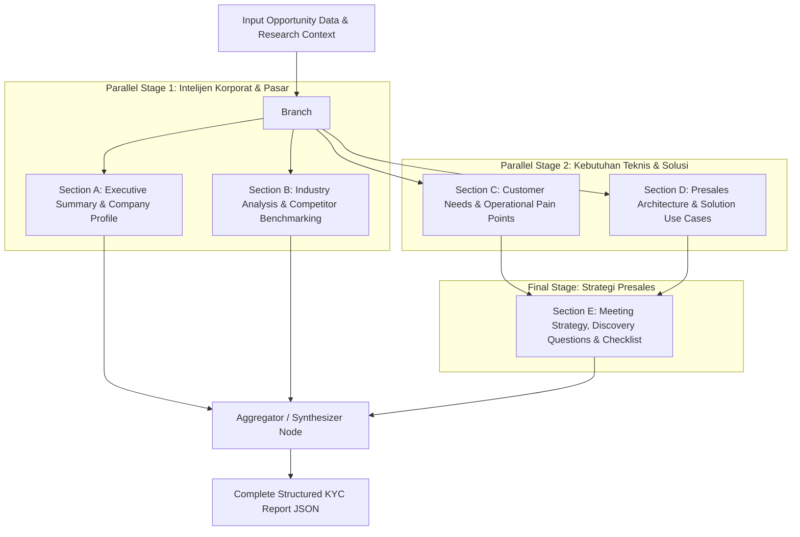

# Blueprint Implementasi Masa Depan (Future Implementation Roadmap)
> **Dokumen Arsitektur & Panduan Pengembangan Lanjutan MOIP**  
> **Status**: Approved for Roadmap | **Target Model Utama**: Google Gemini (Gemini 3.8 Flash & text-embedding-004)

Dokumen ini merangkum rencana arsitektur dan peningkatan strategis untuk platform **Magna Opportunity Intelligence Platform (MOIP)** berdasarkan evaluasi teknis, feedback senior konsultan, dan hasil benchmark multi-model.

---

## Daftar Isi
1. [Inisiatif 1: Generation by Section & Native Structured Output](#inisiatif-1-generation-by-section--native-structured-output)
2. [Inisiatif 2: Penyempurnaan Target Personas (UX & Schema)](#inisiatif-2-penyempurnaan-target-personas-ux--schema)
3. [Inisiatif 3: RAG & Vector Embeddings untuk Magna Solutions Catalog](#inisiatif-3-rag--vector-embeddings-untuk-magna-solutions-catalog)
4. [Rencana Fase Eksekusi & Prioritas](#rencana-fase-eksekusi--prioritas)

---

## Inisiatif 1: Generation by Section & Native Structured Output

### 1.1 Latar Belakang Masalah (Kenapa Perlu Diubah?)
Saat ini, pembuatan laporan KYC dilakukan dalam **satu panggilan LLM monolitik (*single brutal prompt*)**:
- LLM dipaksa menghasilkan seluruh 12 section sekaligus (Executive Summary, Company Overview, Industry Analysis, Competitors, Business Model, Customer Needs, Pain Points, 3 Solusi/Use Cases detail, Meeting Objectives, Questions, Checklist, dan References).
- **Kelemahan Monolitik**:
  1. *Attention Decay*: LLM cenderung dangkal pada bagian tengah atau akhir karena beban instruksi yang terlalu padat dalam satu prompt.
  2. *Brittle JSON Parsing*: Mengandalkan regex pembersih teks (`_clean_and_parse_json`) yang rawan *syntax error* atau terpotong (*truncated*) jika output panjang.
  3. *Sulit Fine-Tuning Per Section*: Tidak bisa memberikan instruksi mendalam (misal: analisis finansial khusus perbankan) tanpa membuat prompt utama membengkak.

### 1.2 Apa itu "Structured Output"?
**Structured Output** adalah fitur mutakhir dari provider AI modern (Google Gemini API & OpenAI) yang menjamin **100% output mematuhi skema JSON (Pydantic Schema)** pada level decoding token:
- Model **tidak akan pernah** menghasilkan JSON rusak, kurung kurawal terpotong, atau markdown pengantar yang tidak diinginkan.
- Di LangChain: menggunakan metode `llm.with_structured_output(PydanticModel)`.
- Di Google GenAI SDK: menggunakan konfigurasi native `generation_config={"response_mime_type": "application/json", "response_schema": PydanticModel}`.
- **Dampaknya**: Seluruh fungsi regex *self-healing* yang rumit dapat dihapus total, dan integritas data API dijamin 100% konsisten.

### 1.3 Arsitektur *Sectional Generation Pipeline* (LangGraph / Asynchronous Modular)
Laporan KYC dipecah menjadi beberapa node generasi modular yang dapat berjalan secara independen atau paralel:



#### Modul-Modul yang Dipisahkan:
1. **Module 1: Corporate Intelligence** (`ExecutiveSummaryModel`, `CompanyOverviewModel`)
   - Fokus: Positioning perusahaan, struktur holding, skala bisnis, dan konteks operasional.
2. **Module 2: Industry & Competition** (`IndustryAnalysisModel`, `List[CompetitorModel]`)
   - Fokus: Regulasi industri (OJK, BI, BSSN), lanskap pasar lokal, dan analisis diferensiasi kompetitor.
3. **Module 3: Technical Pain Points & Core Needs** (`CustomerNeedSummaryModel`, `List[PainPointModel]`)
   - Fokus: Mendiagnosis akar masalah arsitektur existing klien (misal: query join lambat, bottleneck batch ETL H+2).
4. **Module 4: Solutions & Presales Architecture** (`List[PresalesUseCaseModel]`)
   - Fokus: Grounding mendalam dengan portofolio SMG (Greenplum, Dell, Nutanix, BigQuery) dan mitigasi kendala teknis.
5. **Module 5: Presales Execution Strategy** (`MeetingStrategyModel`)
   - Fokus: Pertanyaan discovery discovery tajam per stakeholder dan checklist teknis persiapan POC/meeting.

---

## Inisiatif 2: Penyempurnaan Target Personas (UX & Schema)

### 2.1 Seniority Level: Penambahan Opsi "Others" (Custom Input)
- **Kebutuhan**: Jabatan target meeting di B2B enterprise sering kali spesifik di luar hierarki standar (*Staff, Manager, Head, VP, Director*), contoh: *Lead Enterprise Architect*, *Project Sponsor*, *Chief Information Security Officer (CISO)*, atau *Kepala Divisi Pengadaan (Procurement)*.
- **Perubahan Frontend**:
  - Tambahkan opsi `"Others"` pada tab pilihan Seniority.
  - Ketika `"Others"` dipilih, muncul input field teks interaktif: *"Masukkan level jabatan / peran spesifik (misal: Lead Architect / CISO)"*.
- **Perubahan Backend & Database**:
  - Kolom `seniority` pada tabel `opportunity_personas` sudah bertipe `VARCHAR(50)`, sehingga siap menerima nilai string kustom tanpa perlu migrasi DDL database.
  - Tambahkan sanitasi teks (trim whitespace, batasi max 50 karakter) dan validasi unik `(opportunity_id, seniority, department)`.

### 2.2 Target Department: Hapus "Sales" & Tambahkan Opsi "Others"
- **Kebutuhan**:
  - Hapus departemen **Sales** dari daftar Target Department karena solusi SMG ditujukan untuk infrastruktur IT, keamanan, operasional, data, dan pemangku anggaran (Finance/C-Level), bukan tim penjualan internal klien.
  - Tambahkan departemen **"Others"** yang dapat diisi secara kustom (misal: *Risk & Compliance*, *Legal*, *Audit Internal*, atau *Digital Banking Division*).
- **Daftar Department Baru**:
  - `IT`
  - `Finance`
  - `Operations`
  - `HR`
  - `Marketing`
  - `Others` *(dengan custom text input)*

### 2.3 Perbaikan Subtitle Badge Dummy ("Workflow & KPI")
Di UI tab Target Persona saat ini, tombol departemen menampilkan label dummy fallback:
```tsx
// SEBELUMNYA (Hardcoded Fallback menghasilkan 4 tombol dengan teks identik):
{dept === "IT" ? "Security & Infra" : dept === "Finance" ? "Cost & Budget" : "Workflow & KPI"}
```
- **Label Baru yang Kontekstual & Profesional**:
  - **IT**: *"Security & Infra"* / *"Architecture & Systems"*
  - **Finance**: *"Cost & Budget"* / *"ROI & Capex/Opex"*
  - **Operations**: *"Efficiency & SLA"* / *"Business Continuity"*
  - **HR**: *"People & Culture"* / *"Talent Enablement"*
  - **Marketing**: *"Growth & Brand"* / *"Customer Retention"*
  - **Others**: *"Specialized Domain"* / *"Custom Focus"*

### 2.4 Penerapan Structured Output pada Personas Playbook
Playbook persona juga wajib beralih ke Native Structured Output dengan skema Pydantic:
```python
class PersonaFocusArea(BaseModel):
    priority: str
    impact: str

class PersonaQuestion(BaseModel):
    category: str
    question: str
    rationale: str

class PersonaObjection(BaseModel):
    objection: str
    counter_argument: str

class PersonaPlaybookOutput(BaseModel):
    focus_areas: List[PersonaFocusArea]
    questions: List[PersonaQuestion]
    value_props: List[str]
    objection_handling: List[PersonaObjection]
```

---

## Inisiatif 3: RAG & Vector Embeddings untuk Magna Solutions Catalog

### 3.1 Transisi dari Lexical Search ke Hybrid RAG
Untuk mencegah *false positives* (seperti artikel rumah sakit masuk ke perbankan) sekaligus memastikan relevansi semantik tingkat tinggi saat katalog SMG bertambah besar:

```
                      [ Input Kebutuhan Klien ]
                                  │
                                  ▼
┌───────────────────────────────────────────────────────────────────┐
│ 1. Deterministic Metadata Filter (Hard Constraints)               │
│    - Industry Isolation: Exclude dokumen yang bertag eksklusif    │
│      industri lain (misal: Healthcare jika klien adalah Banking).  │
│    - Deployment Mode: Prioritaskan On-Premises jika klien         │
│      eksplisit meminta server lokal.                              │
└───────────────────────────────────────────────────────────────────┘
                                  │
                                  ▼  (Kandidat Dokumen Terfilter)
┌───────────────────────────────────────────────────────────────────┐
│ 2. Semantic Embedding Similarity (Gemini text-embedding-004)      │
│    - Query Embed: 1 call API ke text-embedding-004               │
│    - Compute Cosine Similarity terhadap Vektor Katalog SMG        │
│    - Ambil Top-K (misal Top 3) Solusi dengan skor tertinggi       │
└───────────────────────────────────────────────────────────────────┘
                                  │
                                  ▼
┌───────────────────────────────────────────────────────────────────┐
│ 3. LLM Generation (Gemini 3.8 Flash)                              │
│    - Menghasilkan rekomendasi use case arsitektural yang akurat   │
│      berdasarkan dokumen resmi terpilih                           │
└───────────────────────────────────────────────────────────────────┘
```

### 3.2 Standardisasi Ekosistem: Google Gemini
- **Generasi & Analisis**: `gemini-3.8-flash` (cepat, cerdas, context window besar, cost-effective).
- **Embedding Model**: `text-embedding-004` (model embedding resmi Google dengan dimensi 768, mendukung retrieval dokumen B2B dengan presisi tinggi).
- **Manajemen Kredensial**: Menggunakan `get_genai_client()` yang sudah ada di `backend/app/core/llm.py` via `GEMINI_API_KEY`.

### 3.3 Mekanisme Caching Vektor (Zero Extra Cost)
- Seluruh 46+ kartu solusi SMG dihitung vektor embedding-nya sekali saja (*pre-computed*).
- Vektor disimpan di file cache JSON lokal (`app/data/solution_embeddings.json`) atau tabel PostgreSQL dengan ekstensi `pgvector`.
- Saat runtime, proses retrieval **hanya melakukan 1 kali API call** untuk embedding query input klien, lalu menghitung *cosine similarity* di memori (< 1 milidetik).

### 3.4 Penambahan Solusi Resmi SMG yang Hilang
Katalog solusi resmi SMG wajib ditambahkan 2 kartu solusi strategis:
1. **On-Premise Enterprise Data Warehouse (EDW) with Greenplum Database (MPP Architecture)**
   - *Teknologi*: Greenplum Database (VMware Tanzu / Open Source MPP), Dell PowerEdge Server, Nutanix HCI, All-Flash NVMe Storage.
   - *Use Case*: Pengolahan data historis skala 10 TB - 100 TB+, pemrosesan query join kompleks antar ratusan tabel, Single Source of Truth on-premises.
2. **Microsoft SQL Server Modernization, Performance Tuning & Hybrid Data Mart**
   - *Teknologi*: Microsoft SQL Server Enterprise, Clustered Columnstore Indexing, In-Memory OLTP, Partitioning, PolyBase.
   - *Use Case*: Optimasi performa database existing, eliminasi query bottleneck, dan offloading beban pelaporan harian.

---

## Rencana Fase Eksekusi & Prioritas

| No | Inisiatif | Estimasi Kompleksitas | Komponen Terdampak | Prioritas |
|---|---|---|---|---|
| 1 | **Katalog RAG & Solusi Greenplum/SQL Server** | Menengah | `backend` (`solutions_catalog.py`, `embedding_service.py`, data kartu) | **Tinggi (P1)** |
| 2 | **Penyempurnaan Target Personas (Others & Subtitle)** | Rendah - Menengah | `frontend` (`TargetPersonaTab.tsx`), `backend` (`persona_service.py`) | **Tinggi (P1)** |
| 3 | **Sectional KYC Generation & Structured Output** | Menengah - Tinggi | `backend` (`kyc_pipeline.py`, schema Pydantic) | **Strategis (P2)** |

---
*Dokumen ini merupakan acuan resmi untuk iterasi pengembangan berikutnya di MOIP.*
