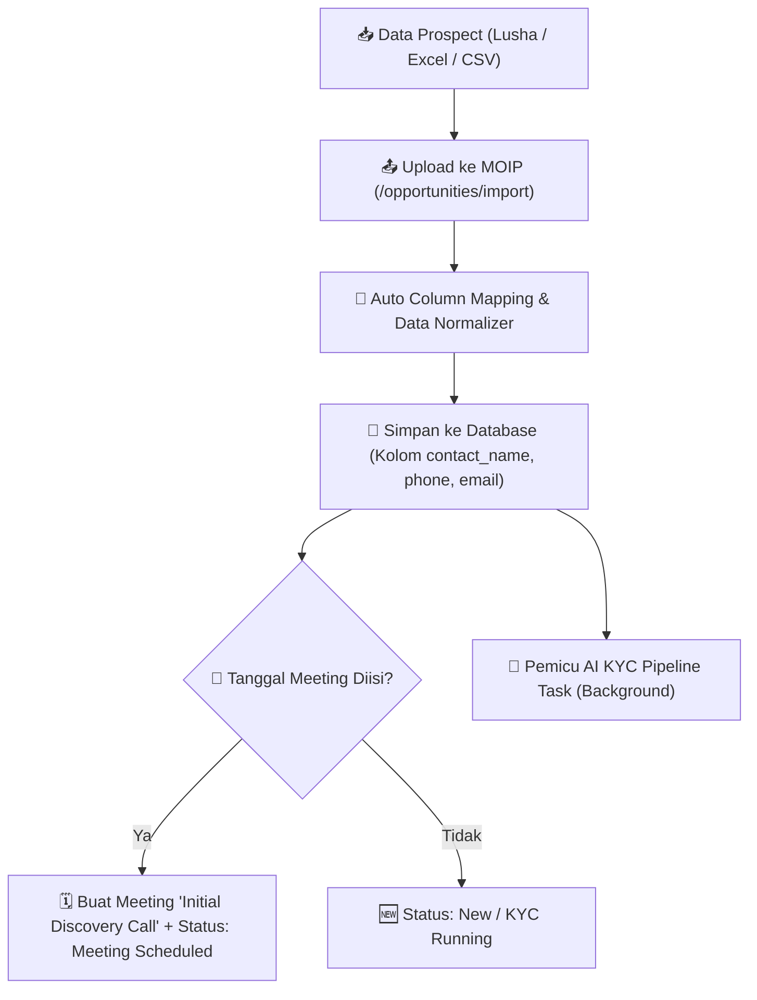

# 📄 Rangkuman Diskusi & Arsitektur: Lead Import Connector & Contact Profile (MOIP)

> **Dokumen Referensi Implementasi:** Rangkuman alur kerja penarikan data lead (Lusha / Spreadsheet), struktur profil kontak kustom, dan sinkronisasi otomatis meeting & pipeline di Magna Opportunity Intelligence Platform (MOIP).

---

## 🎯 1. Latar Belakang & Masalah Utama (Problem Statement)

Sebelumnya, **Lead Gen Officer (LGO)** merasa kerepotan karena harus:
1. Mencari data prospek/lead dari platform prospeksi (seperti **Lusha**, **LinkedIn Sales Navigator**, atau **Spreadsheet/Excel**).
2. Memindahkan atau mengetik ulang data prospek (Nama Perusahaan, Nama Kontak/PIC, Email, Nomor Telepon/WA) satu per satu secara manual ke dalam form MOIP.

---

## 💡 2. Solusi yang Diterapkan di MOIP

MOIP menyediakan **Bulk Lead Import Connector** yang menggantikan peran spreadsheet manual dan menyederhanakan alur kerja LGO secara drastis.

### 🌟 Fitur Utama:
1. **Dukungan Format File CSV & Excel (`.xlsx`):** LGO dapat mengunggah file ekspor dari Lusha/Spreadsheet dalam satu klik.
2. **Smart Header Auto-Mapping:** Sistem cerdas otomatis mengenali dan memetakan nama kolom dari berbagai istilah:
   * **Perusahaan:** `company_name`, `company`, `perusahaan`, `client`
   * **Kontak PIC:** `contact_name`, `contact_person`, `pic`, `nama_kontak`, `penanggung_jawab`
   * **Email:** `email`, `surel`, `email_pic`
   * **No. Telepon / WA:** `phone`, `no_hp`, `no_telp`, `whatsapp`
   * **Sektor / Industri:** `industry`, `sektor`
   * **Solusi Target:** `product`, `solution`, `solusi`
   * **Nilai Proyek:** `potential_revenue`, `deal_value`, `nilai_deal`
   * **Jadwal Meeting:** `estimated_agenda_date`, `tanggal_agenda`, `jadwal`
3. **Pembersihan & Normalisasi Data Otomatis:**
   * Nomor HP lokal (misal: `08123456789`) otomatis diformat menjadi standar internasional `+628123456789`.
   * Email dan spasi berlebih (*whitespace*) dibersihkan secara otomatis.
4. **Pemicu AI KYC & Schedule Meeting Otomatis:**
   * Setiap lead yang diimpor langsung memicu pembuatan **Initial Discovery Call** jika tanggal jadwal diisi.
   * Laporan kecerdasan **AI KYC Intelligence Report** otomatis dibuat secara background.

---

## 🏗️ 3. Alur Kerja Otomatisasi (Workflow Pipeline)



---

## 👤 4. Struktur Profil Kontak Klien di MOIP

Setiap Opportunity di MOIP kini dilengkapi dengan kartu **Company & Contact Information** yang menyimpan profil lengkap:

| Nama Variabel | Label di UI | Deskripsi & Contoh |
| :--- | :--- | :--- |
| `company_name` | **Company** | Nama perusahaan prospect (misal: *PT Bank Mandiri Sejahtera*) |
| `contact_name` | **Contact PIC** | Nama person in charge / kontak utama (misal: *Bpk. Hendra Setiawan*) |
| `email` | **Email** | Email resmi kontak (misal: *hendra@mandirisejahtera.co.id*) |
| `phone` | **Phone** | No. HP / WhatsApp terformat (misal: *+62 812-3456-7890*) |
| `website` | **Website** | URL domain (misal: *https://mandirisejahtera.co.id*) |
| `industry` | **Industry** | Bidang usaha (misal: *Banking / Financial Services*) |
| `product` | **Solution** | Solusi target (misal: *Data Analytics Platform*) |

---

## 🔄 5. Aturan Transisi Status Meeting Otomatis

Untuk menjaga konsistensi antara data Opportunity dan riwayat Meeting:

1. **Pembuatan Pertama (Initial Meeting):**
   * Saat LGO memasukkan tanggal rapat perdana, status Opportunity otomatis menjadi **`Meeting Scheduled`** (jika tanggal di masa depan) atau **`Meeting Done`** (jika tanggal di masa lalu).
2. **Pengisian Rapat Baru via Tombol `Log Meeting`:**
   * Jika dibuat jadwal rapat baru di masa depan, status Opportunity otomatis bergeser kembali menjadi **`Meeting Scheduled`**.
   * Tanggal `Next Meeting` otomatis diperbarui ke jadwal rapat terbaru tersebut.
3. **Transisi Tahap Selanjutnya:**
   * Pengguna dapat secara manual memindahkan status ke tahap **`Need Proposal`**, **`Negotiation`**, **`PO`**, atau **`Won`** sesuai perkembangan deal.

---

## 🔒 6. Aturan Hak Akses Role (RBAC)

| Role | Hak Akses Lead Import | Akses Nilai Finansial |
| :--- | :--- | :--- |
| **Superadmin / Admin** | Full Create, Edit, Import, Delete | Full View (Terlihat) |
| **Manager / Sales** | Full Create, Edit, Import | Full View (Terlihat) |
| **Lead Gen Officer (LGO)** | Full Create, Edit, Import | Full View (Terlihat) |
| **Pre-Sales Engineer** | View Only (Tidak bisa ubah status/impor) | **Ter-masking (`••••••••`)** |

---

## 📌 7. Perintah Update di Server VM

Untuk menerapkan seluruh perubahan ini di server VM:

```bash
cd ~/magna-opportunity-intelligence-platform && git pull origin main && docker compose up -d --build
```
