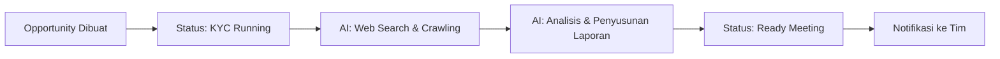

# Panduan Pengguna: Magna Opportunity Intelligence Platform (MOIP)

Selamat datang di **Magna Opportunity Intelligence Platform (MOIP)** — sistem kecerdasan peluang pre-sales terintegrasi AI untuk PT Smartnet Magna Global (SMG).

Dokumen ini adalah panduan lengkap bagi seluruh pengguna end-user: **Lead Generation Officer (LGO)**, **Pre-sales Engineer**, **Sales**, **Manager**, hingga **Admin**.

---

## Daftar Isi

1. [Quick Start Guide (5 Menit)](#1-quick-start-guide-5-menit)
2. [Akses & Autentikasi Sistem](#2-akses--autentikasi-sistem)
3. [Input & Manajemen Opportunity](#3-input--manajemen-opportunity)
4. [Riset KYC AI (Know Your Customer)](#4-riset-kyc-ai-know-your-customer)
5. [Penyiapan Rapat: Target Persona Playbook](#5-penyiapan-rapat-target-persona-playbook)
6. [Manajemen Pertemuan (Meetings) & Document Hub](#6-manajemen-pertemuan-meetings--document-hub)
7. [Chat with AI Assistant](#7-chat-with-ai-assistant)
8. [Pipeline & Status Lifecycle](#8-pipeline--status-lifecycle)
9. [Dashboard & Analitik](#9-dashboard--analitik)
10. [Fitur Produktivitas Pendukung](#10-fitur-produktivitas-pendukung)
11. [Sistem Role & Kapabilitas Akun](#11-sistem-role--kapabilitas-akun)
12. [Panel User Management (Khusus Admin)](#12-panel-user-management-khusus-admin)
13. [Skenario Lapangan (End-to-End Walkthrough)](#13-skenario-lapangan-end-to-end-walkthrough)
14. [FAQ & Troubleshooting](#14-faq--troubleshooting)

---

## 1. Quick Start Guide (5 Menit)

Panduan kilat untuk langsung produktif:

```
┌─────────────────────────────────────────────────────────────────────┐
│  LANGKAH 1 ──► Login via Google (@magnaglobal.id)                  │
│  LANGKAH 2 ──► Buat Opportunity baru (isi data klien & kebutuhan)  │
│  LANGKAH 3 ──► Tunggu KYC AI selesai (~3-5 menit)                 │
│  LANGKAH 4 ──► Buka Target Persona → Generate Strategy             │
│  LANGKAH 5 ──► Siap meeting! 🎯                                   │
└─────────────────────────────────────────────────────────────────────┘
```

### Siapa melakukan apa?

| Peran | Tugas Utama di MOIP |
| :--- | :--- |
| **LGO / Sales** | Input leads baru, isi data peluang, pantau pipeline |
| **Pre-sales Engineer** | Baca KYC, buat Persona Playbook, konsultasi arsitektur via AI Chat |
| **Manager** | Monitor dashboard performa, tinjau status pipeline, filter per engineer |

---

## 2. Akses & Autentikasi Sistem

### 2.1 Login dengan Google Workspace

1. Buka URL portal MOIP di browser.
2. Klik tombol **Sign in with Google**.
3. Pilih akun email kantor Anda (`namaanda@magnaglobal.id`).
4. Sistem memverifikasi akun → token sesi dibuat → Anda diarahkan ke halaman **Dashboard**.

> **Penting**: Gunakan hanya akun email resmi `@magnaglobal.id`. Akun Gmail pribadi tidak didukung.

### 2.2 Akun Baru — Pertama Kali Login

- Setiap akun yang **baru pertama kali** login otomatis mendapatkan role **Viewer** dengan kapabilitas *View* saja.
- Anda hanya bisa melihat dashboard dan daftar peluang, belum bisa membuat atau mengedit.
- Anda bisa menginfokan **Nixon** atau **Robi** untuk meminta upgrade kapabilitas sesuai peran Anda.

### 2.3 Logout

Klik avatar / inisial profil Anda di pojok kanan atas navigasi, lalu pilih **Logout**. Token sesi akan dihapus dari browser.

---

## 3. Input & Manajemen Opportunity

### 3.1 Membuat Opportunity Baru (Form Manual)

1. Dari menu sidebar kiri, klik **Opportunities**.
2. Klik tombol **New Opportunity** (hanya muncul jika Anda memiliki kapabilitas *Create & Edit*).
3. Isi formulir berikut:

| Field | Wajib? | Keterangan |
| :--- | :---: | :--- |
| **Company Name** | ✅ | Nama perusahaan calon klien |
| **Target Solution** | ✅ | Solusi yang ditawarkan (misal: *Google Cloud Infrastructure*, *Data Analytics & AI*, *Cybersecurity Suite*) — bisa pilih lebih dari satu |
| **Customer Needs** | ✅ | Deskripsi kebutuhan/pain point klien |
| **Contact PIC** | ─ | Nama & jabatan kontak utama |
| **Email** | ─ | Email kontak PIC |
| **Phone** | ─ | Nomor telepon PIC |
| **Website** | ─ | URL website perusahaan (membantu AI crawl data perusahaan lebih akurat) |
| **Industry** | ─ | Sektor industri klien (dipilih dari daftar master data) |
| **Assigned Pre-Sales** | ─ | Presales engineer yang ditugaskan |
| **Potential Revenue** | ─ | Estimasi nilai proyek/deal (dalam Rupiah) |
| **Estimated Agenda Date** | ─ | Target tanggal rapat/closing pertama |
| **Additional Context for AI** | ─ | Konteks tambahan spesifik untuk AI (lihat Bagian 3.3) |

4. Klik **Create Opportunity**.
5. Sistem otomatis memproses peluang dan memicu pipeline **KYC AI** di background.


### 3.2 Bulk Import Leads (CSV/Excel)

Untuk input massal dari event/pameran/daftar prospek:

1. Dari halaman **Opportunities**, klik tombol **Import Leads**.
2. Unduh template CSV/Excel terlebih dahulu dengan klik **Download Template**.
3. Isi spreadsheet dengan kolom berikut:

```
company_name, contact_name, email, phone, website, industry, product,
potential_revenue, estimated_agenda_date, customer_needs
```

4. Drag & drop file ke area upload, atau klik untuk memilih file (format `.csv`, `.xlsx`, `.xls`).
5. Klik **Upload & Import**.
6. Sistem menampilkan ringkasan hasil: jumlah berhasil diimpor dan baris yang gagal (jika ada).

### 3.3 Tips: Additional Context for AI

Field **Additional Context for AI** bersifat opsional tetapi **sangat berpengaruh** pada kualitas riset KYC.

Teks yang Anda isi di sini disertakan langsung ke dalam prompt instruksi AI saat pipeline KYC dijalankan. Semakin spesifik konteks yang diberikan, semakin terarah rekomendasi solusi dan use case yang dihasilkan.

**Contoh isi yang baik:**
```
Klien saat ini menggunakan infrastruktur On-Premise VMware dengan biaya 
lisensi yang sangat mahal. Tertarik migrasi ke Google Cloud. Fokus utama 
adalah cost optimization dan disaster recovery. Sudah pernah demo dengan 
kompetitor AWS tapi belum deal.
```

```
Perusahaan klien baru saja mengakuisisi 3 anak perusahaan. Butuh 
konsolidasi data warehouse dan implementasi analytics dashboard untuk 
C-Level. Deadline keputusan Q3 2026.
```

### 3.4 Tampilan Opportunities: Kanban vs Tabel

Halaman **Opportunities** menyediakan dua mode tampilan:

- **Kanban Board**: Papan kartu visual per kolom status. Anda dapat drag & drop kartu antar kolom untuk mengubah status.
- **Table View**: Tampilan daftar tabel ringkas dengan sorting dan pencarian.

Gunakan filter di atas daftar untuk menyaring berdasarkan:
- **Status**: New, KYC Running, Ready Meeting, Meeting Scheduled, dll.
- **Search**: Cari berdasarkan nama perusahaan atau kebutuhan klien.

### 3.5 Multi-Contact Person

Setiap opportunity mendukung daftar kontak lebih dari satu orang. Di halaman detail opportunity (tab **Overview**), Anda bisa menambahkan beberapa kontak PIC dengan informasi:
- Nama
- Jabatan/Role
- Email
- Nomor Telepon

Ini berguna ketika Anda berhubungan dengan beberapa PIC sekaligus (contoh: PIC Teknis, PIC Bisnis, PIC Pengadaan).

---

## 4. Riset KYC AI (Know Your Customer)

KYC adalah jantung dari MOIP — riset pelanggan otomatis berbasis AI yang memperkaya setiap peluang dengan intelijen bisnis.

### 4.1 Bagaimana KYC Berjalan?



Pipeline KYC terdiri dari 2 fase utama:
1. **Research Node**: AI melakukan pencarian web (Tavily/Google Search Grounding) dan crawling website perusahaan klien.
2. **Analysis Node**: AI menganalisis semua data riset dan menyusun laporan KYC lengkap, termasuk rekomendasi solusi dari **Katalog Smartnet Magna**.

**Durasi**: ± 1–3 menit (tergantung ketersediaan sumber data dan beban model AI).


### 4.2 Memahami Isi Laporan KYC

Buka halaman detail opportunity → tab **KYC Report**. Laporan terdiri dari:

| Bagian | Isi |
| :--- | :--- |
| **Executive Summary** | Ringkasan eksekutif peluang dan konteks klien |
| **Company Overview** | Profil perusahaan: lokasi, jumlah karyawan, tahun berdiri, deskripsi bisnis |
| **Industry Analysis** | Analisis tren dan tantangan di sektor industri klien |
| **Business Model** | Model bisnis dan sumber pendapatan utama klien |
| **Competitor Analysis** | Peta kompetitor di pasar klien: kekuatan, kelemahan, dan **diferensiasi Smartnet Magna** |
| **Customer Need Summary** | Rangkuman kebutuhan berdasarkan input awal + temuan riset |
| **Potential Pain Points** | Titik-titik masalah yang kemungkinan besar dihadapi klien |
| **Use Cases & Solution Mapping** | Rekomendasi use case riil + solusi dari **Katalog Smartnet Magna** + produk **Google Cloud**, lengkap dengan tingkat dampak (*High/Medium/Low*) |
| **Meeting Objectives** | Tujuan rapat yang direkomendasikan |
| **Recommended Discovery Questions** | Pertanyaan-pertanyaan kunci untuk dibawa ke rapat awal |
| **Preparation Checklist** | Daftar item persiapan sebelum rapat |
| **References** | Sumber URL riset yang valid dan dapat diverifikasi |

> [!TIP]
> **Mekanisme Grounding Cerdas (Dynamic Solution Grounding)**:  
> AI tidak merekomendasikan solusi generik atau berhalusinasi. Sistem mencocokkan industri (*industry*), produk yang dipilih (*product*), dan deskripsi kebutuhan (*customer needs*) klien dengan **Katalog Solusi Resmi PT Smartnet Magna Global** di database. Hasilnya, bab *Use Cases & Solution Mapping* langsung memetakan arsitektur konkret (seperti *Pub/Sub → Dataflow → BigQuery ML*, *Modern Endpoint Security NGAV*, atau *Homogeneous Database Migration ke Cloud SQL*) lengkap dengan studi kasus terbukti dan tautan artikel resmi.

### 4.3 Regenerasi & Editing KYC

- **Regenerate KYC**: Klik tombol **Regenerate** (memerlukan kapabilitas *Generate KYC*). Berguna jika ada update data klien, kebutuhan berubah, atau riset awal dirasa kurang lengkap. Ini menghasilkan versi baru.
- **Edit KYC**: Klik tombol **Edit** (memerlukan kapabilitas *Create & Edit*). Engineer dapat menyunting isi laporan secara manual — misalnya menambahkan temuan dari rapat awal atau mengoreksi informasi yang kurang tepat.
- **Version History**: Gunakan dropdown **Version Selector** untuk menelusuri riwayat versi KYC sebelumnya.

### 4.4 Progres Bar Real-Time

Saat KYC sedang berjalan, bilah progres interaktif ditampilkan di atas laporan. Progres menunjukkan tahapan pipeline secara real-time:
- `pending` → `researching` → `analyzing` → `completed` (atau `failed`)

Jika status `failed`, pesan error akan ditampilkan. Anda dapat klik **Regenerate** untuk mencoba lagi.

---

## 5. Penyiapan Rapat: Target Persona Playbook

Fitur **Target Persona** menghasilkan strategi presales interaktif yang disesuaikan berdasarkan **siapa** yang akan Anda temui di rapat.

### 5.1 Cara Menggunakan

1. Buka halaman detail opportunity → tab **Target Persona**.
2. Pilih **Seniority** (level jabatan) lawan bicara:
   - `C-Level` | `VP/Director` | `Manager` | `Lead/Senior` | `Staff`
3. Pilih **Department** (divisi) lawan bicara:
   - `IT` | `Data & AI` | `Security` | `Finance` | `Operations` | `Business`
4. Klik tombol **Generate Strategy**.
5. AI menyusun playbook dalam ~30–60 detik.

> **Catatan**: Anda bisa menelusuri playbook posisi lain sementara proses generate untuk posisi tertentu masih berjalan di background.

### 5.2 Isi Playbook Persona

Setiap playbook memuat empat bagian utama:

#### A. Strategic Concerns & Red Flags
Apa yang dikhawatirkan dan diprioritaskan oleh persona ini. Misalnya, seorang *C-Level IT* lebih fokus pada ROI dan keamanan enterprise, sedangkan *Manager Operations* lebih peduli pada efisiensi operasional harian.

#### B. Discovery & Technical Questions
Daftar pertanyaan discovery dan teknis yang direkomendasikan, beserta **latar belakang alasan** (*rationale*) mengapa pertanyaan tersebut penting ditanyakan.

Contoh:
> **Pertanyaan**: "Bagaimana arsitektur data pipeline Anda saat ini menangani volume data yang meningkat setiap kuartal?"
>
> **Rationale**: Memahami bottleneck infrastruktur data saat ini membuka peluang rekomendasi Google BigQuery atau Dataflow.

#### C. Tailored Value Proposition
Proposisi nilai yang dirumuskan spesifik sesuai bahasa dan prioritas persona. Nilai jual ke CFO berbeda dengan nilai jual ke Head of Engineering.

#### D. Objection Handling
Antisipasi keberatan yang mungkin muncul beserta rekomendasi respon taktis. Contoh:
> **Keberatan**: "Kami sudah punya tim internal untuk ini."
>
> **Rekomendasi Jawaban**: "Tim internal Anda tetap memegang kendali penuh. Solusi kami justru mempercepat delivery tim Anda 3x lipat dengan menghilangkan overhead infrastruktur."

### 5.3 Kapan Membuat Persona Baru?

- Sebelum rapat pertama: buat persona sesuai peserta rapat yang sudah dikonfirmasi.
- Sebelum rapat lanjutan: jika peserta dari divisi/level berbeda akan hadir.
- Saat strategi perlu di-refresh setelah ada informasi baru dari rapat sebelumnya.


---

## 6. Manajemen Pertemuan (Meetings) & Document Hub

### 6.1 Mencatat & Menjadwalkan Rapat (Meetings)

#### Dari Halaman Detail Opportunity:
1. Klik tombol **Log Meeting** atau **Add Meeting** di header halaman.
2. Isi detail rapat:
   - **Judul Rapat** (misal: "Discovery Meeting - PT ABC")
   - **Tanggal & Waktu**
   - **Lokasi** (Zoom, Google Meet, Kantor Klien, dll.)
   - **Peserta** (daftar nama/email internal & eksternal)
   - **Agenda** (poin-poin yang akan dibahas)
   - **Catatan Rapat** (notulen/MoM)
   - **Action Items** (tindak lanjut pasca rapat)
3. Klik **Save**.

#### Dari Menu Meetings (Sidebar):
Menu **Meetings** di sidebar kiri menampilkan daftar rapat global lintas semua opportunity. Berguna bagi manager untuk memantau jadwal pertemuan seluruh tim.

#### Reminder Otomatis:
Sistem mengirim notifikasi pengingat rapat secara otomatis:
- **H-24**: Pengingat 24 jam sebelum rapat.
- **H-1**: Pengingat 1 jam sebelum rapat.

### 6.2 Document Hub (Resources)

Pusat penyimpanan tautan dokumen & referensi penting untuk setiap opportunity.

1. Buka halaman detail opportunity → tab **Resources**.
2. Klik **Add Document**.
3. Isi:
   - **Judul Dokumen** (misal: "Proposal Teknis v2", "MoM Discovery Meeting")
   - **URL** (tautan Google Drive, Docs, Sheets, atau URL lainnya)
   - **Deskripsi** (ringkasan isi dokumen)
   - **Labels** (tag kategori: `MoM`, `Solution Brief`, `Compro`, `Proposal`, dll.)
4. Klik **Save**.

**Tips penggunaan Resources:**
- Tautkan **Minutes of Meeting (MoM)** setelah setiap rapat selesai.
- Simpan **Proposal Penawaran Teknis** dan **Solution Brief** agar seluruh tim bisa mengakses.
- Gunakan **Labels** untuk memfilter dokumen dengan cepat.
- Klik tautan untuk membuka berkas asli langsung di tab baru browser.

---

## 7. Chat with AI Assistant

Panel AI Chat adalah asisten pintar kontekstual yang memahami riwayat opportunity & laporan KYC saat ini.

### 7.1 Cara Mengakses

Dari halaman detail opportunity, klik tombol **Chat with AI** di header. Panel slide-over akan muncul di sisi kanan layar.

### 7.2 Fitur Chat

- **Streaming Output**: Jawaban AI mengalir secara langsung (real-time), bukan menunggu seluruh respons selesai.
- **Saran Pertanyaan**: Panel menampilkan rekomendasi pertanyaan relevan di awal sesi untuk membantu memulai percakapan.
- **Resize Panel**: Tombol *Maximize/Minimize* untuk memperlebar (650px) atau mempersempit (400px) panel.
- **Grounding Solusi Resmi PT SMG**: Asisten AI secara otomatis disuntikkan ringkasan katalog solusi dan arsitektur produk yang relevan dengan opportunity saat ini. Anda dapat meminta saran arsitektur teknis atau diferensiasi produk tanpa takut AI berhalusinasi.
- **Retensi Riwayat**: Riwayat obrolan disimpan di database dan otomatis dihapus setelah **7 hari**.

### 7.3 Contoh Prompt yang Berguna

| Kebutuhan | Contoh Prompt |
| :--- | :--- |
| Arsitektur Cloud | "Rekomendasikan arsitektur GCP untuk migrasi data warehouse klien ini dari on-premise ke cloud" |
| Estimasi Sizing | "Berapa estimasi kebutuhan compute dan storage jika klien memiliki 50TB data warehouse?" |
| Simulasi Q&A | "Simulasikan sesi tanya jawab teknis jika CTO klien bertanya soal keamanan data di cloud" |
| Draf Email Follow-Up | "Buatkan draf email follow-up pasca rapat discovery untuk klien ini" |
| Perbandingan Solusi | "Bandingkan keunggulan Google Cloud vs AWS untuk use case data analytics klien ini" |
| Strategi Penawaran | "Berikan strategi penawaran harga untuk kompetisi melawan IBM di klien ini" |


---

## 8. Pipeline & Status Lifecycle

Setiap opportunity melewati siklus hidup status yang menggambarkan tahapan proses pre-sales.

### 8.1 Daftar Status & Alur

```
New ──► KYC Running ──► Ready Meeting ──► Meeting Scheduled ──► Meeting Done
                                                                      │
            ┌──────────────────────────────────────────────────────────┘
            ▼
      Need Proposal ──► POC ──► Negotiation ──► PO ──► Won
                                                 │
                                          Lost ◄─┘
                                          On Hold
```

### 8.2 Penjelasan Setiap Status

| Status | Otomatis / Manual | Kapan Digunakan? |
| :--- | :---: | :--- |
| **New** | Otomatis | Saat opportunity baru dibuat |
| **KYC Running** | Otomatis | Saat pipeline KYC AI sedang memproses riset |
| **Ready Meeting** | Otomatis | Setelah riset KYC berhasil diselesaikan |
| **Meeting Scheduled** | Manual | Setelah jadwal rapat awal dikonfirmasi oleh klien |
| **Meeting Done** | Manual | Setelah rapat awal selesai dilaksanakan dan dicatat |
| **Need Proposal** | Manual | Jika hasil rapat menyimpulkan klien butuh proposal teknis formal |
| **POC** | Manual | Jika klien memerlukan Proof of Concept / demo teknis sebelum keputusan |
| **Negotiation** | Manual | Saat penawaran harga sudah dikirim dan sedang dinegosiasikan |
| **PO** | Manual | Saat dokumen Purchase Order resmi diterima dari klien |
| **Won** | Manual | Kontrak ditandatangani, deal berhasil dimenangkan 🎉 |
| **Lost** | Manual | Klien memilih solusi lain atau membatalkan |
| **On Hold** | Manual | Proyek ditunda oleh klien (lebih dari 1 bulan) |

### 8.3 Cara Mengubah Status

Ada dua cara mengubah status:
1. **Dari halaman detail**: Klik dropdown status di sebelah nama perusahaan → pilih status baru.
2. **Dari Kanban board**: Drag & drop kartu opportunity ke kolom status yang diinginkan.

---

## 9. Dashboard & Analitik

Halaman **Dashboard** adalah pusat pemantauan performa presales secara menyeluruh.

### 9.1 KPI Cards

| Metrik | Deskripsi |
| :--- | :--- |
| **Total Opportunities** | Jumlah keseluruhan peluang pre-sales terdaftar |
| **Active Pipelines** | Peluang aktif yang sedang dalam pengerjaan (mengecualikan *Won*, *Lost*, *On Hold*) |
| **Meetings Today** | Jumlah rapat yang dijadwalkan hari ini |
| **Need Follow Up** | Peluang yang membutuhkan tindakan segera |

### 9.2 Visualisasi Analitik

- **Status Distribution**: Grafik lingkaran sebaran status seluruh peluang.
- **Pipeline Trend**: Tren pendaftaran peluang baru dalam 30 hari terakhir.
- **Solution Distribution**: Grafik sebaran solusi yang ditawarkan.
- **Industry Distribution**: Grafik batang persebaran sektor industri klien.
- **Pipeline Funnel**: Visualisasi corong konversi dari leads ke won.

### 9.3 Filter Dashboard

Saring metrik berdasarkan:
- **Rentang Tanggal**: Pilih periode *date_from* — *date_to*.
- **Pre-sales Engineer**: Filter per nama engineer yang ditugaskan.


---

## 10. Fitur Produktivitas Pendukung

### 10.1 Pencarian Global

Pada bilah navigasi atas, klik ikon pencarian. Ketik nama perusahaan, kontak, atau kebutuhan untuk mencari instan di seluruh pipeline.

### 10.2 Multi-Bahasa (Language Switcher)

Klik tombol **ID** / **EN** di navigasi atas untuk berpindah bahasa antarmuka secara instan antara Bahasa Indonesia dan Bahasa Inggris. Tidak perlu refresh halaman.

### 10.3 Dark / Light Mode

Klik ikon tema (bulan/matahari) di navigasi atas untuk beralih antara mode gelap dan terang. Preferensi disimpan otomatis di browser.

### 10.4 Pusat Notifikasi

Klik ikon lonceng di navigasi atas. Notifikasi mencakup:
- **Opportunity Dibuat**: Ketika ada peluang baru yang masuk.
- **KYC Selesai**: Ketika riset KYC AI telah rampung dan siap dibaca.
- **Status Berubah**: Ketika status peluang yang ditugaskan kepada Anda berubah.
- **Meeting Reminder**: Pengingat h-24 dan h-1 sebelum rapat.
- **Follow-Up**: Pengingat tindak lanjut.

Anda dapat menandai notifikasi sebagai sudah dibaca satu per satu, atau klik **Mark All as Read**.

### 10.5 Timeline (Jejak Audit Otomatis)

Di halaman detail opportunity → tab **Timeline**, sistem mencatat setiap peristiwa penting secara otomatis:
- Pembuatan opportunity
- Perubahan status
- Rapat dijadwalkan/selesai
- KYC di-generate atau diperbarui
- Data opportunity diedit

---

## 11. Sistem Role & Kapabilitas Akun

MOIP menggunakan sistem dua-lapis: **Role** (label jabatan) dan **Kapabilitas** (izin aksi nyata).

### 11.1 Tabel Role & Kapabilitas Default

| Role | Kapabilitas Default |
| :--- | :--- |
| **Viewer** | View saja |
| **Engineer** | View + Generate KYC |
| **Sales** | View + Create & Edit + Delete + Generate KYC |
| **Presales** | View + Create & Edit + Delete + Generate KYC |
| **LGO** | View + Create & Edit + Delete + Generate KYC |
| **Manager** | View + Create & Edit + Delete + Generate KYC |
| **Admin** | Semua kapabilitas + User Management |

### 11.2 Penjelasan Kapabilitas

| Kapabilitas | Keterangan |
| :--- | :--- |
| **View** | Melihat dashboard, daftar peluang, detail, dan laporan KYC |
| **Create & Edit** | Membuat peluang baru, mengubah data, log rapat, menambah dokumen |
| **Delete** | Menghapus peluang dan rapat |
| **Generate KYC** | Memicu dan me-regenerate laporan KYC AI serta Target Persona |
| **User Management** | Mengakses panel manajemen akun pengguna di Settings |

> **Catatan**: Role hanya merupakan label identitas. **Kapabilitas** yang benar-benar menentukan apa yang bisa dilakukan pengguna. Anda bisa menginfokan **Nixon** atau **Robi** untuk meminta upgrade kapabilitas sesuai peran Anda.


---

## 12. Panel User Management (Khusus Admin)

### 12.1 Mengubah Akses Pengguna

1. Buka **Settings** dari menu navigasi kiri.
2. Klik tab **User Management**.
3. Temukan pengguna yang ingin diubah.
4. Klik tombol **Edit Access** pada kartu pengguna.
5. **Pilih Role**: Memilih role otomatis menyetel kapabilitas default role tersebut.
6. **Atur Kapabilitas**: Toggle individu (*View*, *Create & Edit*, *Delete*, *Generate KYC*, *User Management*) secara granular.
7. **Status Akun**: Toggle on/off untuk mengaktifkan atau menonaktifkan akun.
8. Klik **Save**.

> Admin **tidak dapat** mengubah role atau menonaktifkan akun mereka sendiri untuk mencegah lockout sistem.

### 12.2 Monitoring Aktivitas Pengguna

Di panel User Management, Admin dapat melihat:
- **Last Active**: Kapan pengguna terakhir kali aktif.
- **Monthly Active Days**: Berapa hari pengguna aktif dalam sebulan.
- **Activity Drawer**: Klik pengguna untuk melihat jejak aktivitas kronologis detail (*audit trail*).

### 12.3 AI Token Monitoring (Admin)

Tab **AI Token Monitoring** menampilkan:
- Total konsumsi token AI (per hari, per model, tren 14 hari).
- Estimasi biaya dalam USD dan IDR.
- Breakdown penggunaan per opportunity dan per user (untuk deteksi penyalahgunaan).
- Audit log transparan: query prompt pengguna dan respons AI.

### 12.4 Magna Solutions Catalog

Tab **Magna Solutions Catalog** memungkinkan seluruh tim meninjau dan Administrator mengelola referensi solusi pre-sales resmi PT Smartnet Magna Global:
- **Filter Berdasarkan Pilar**: Cloud & Infra, Data & AI, Cybersecurity, Network & Workplace.
- **Filter Tingkat (Tier)**:
  - **Tier 1 (Core Products & Case Studies)**: Solusi konkret dengan bukti implementasi dan produk nyata (contoh: *Fraud Detection BigQuery ML*, *Modernland Realty NGAV Case Study*, *VMware Exit Strategy ke GKE*, *Serverless Cloud Run*).
  - **Tier 2 (Niche Concepts & Architectures)**: Kerangka kerja strategis dan arsitektur spesifik industri (contoh: *Zero Trust BeyondCorp*, *All-Flash Storage Rekam Medis RS*, *NDR untuk BFSI*, *Cloud Backup Pasca Insiden PDN*).
- **Pencarian Cepat**: Temukan solusi secara instan berdasarkan nama produk (e.g. *BigQuery*, *GKE*, *Palo Alto*), pain points klien, atau industri target.
- **Tautan Langsung ke Artikel**: Klik ikon tautan eksternal pada kartu solusi untuk membuka artikel referensi teknis asli di situs `magnaglobal.id`.
- **Manajemen Mandiri (CRUD untuk Admin)**:
  - **Tambah Solusi**: Klik tombol **+ Tambah Solusi** untuk mendaftarkan use case atau arsitektur produk baru.
  - **Edit & Nonaktifkan**: Admin dapat memperbarui produk terkait, target vertikal industri, kendala yang diselesaikan, dampak bisnis, atau menonaktifkan solusi sementara waktu tanpa menghapusnya.
  - **Hapus**: Menghapus kartu solusi yang sudah tidak relevan.
  - **Sinkronisasi Otomatis**: Setiap perubahan (tambah/edit/hapus) langsung memicu pembaruan memori di backend (*real-time cache reload*). AI KYC Pipeline dan AI Pre-Sales Chat detik itu juga langsung mengenali data terbaru tanpa perlu deploy ulang sistem.

> [!TIP]
> **Tips bagi Pre-Sales & Admin**: Saat menambahkan solusi baru, pastikan mencantumkan **Produk Utama** yang spesifik (misal: *BigQuery, Vertex AI, Dataflow*) dan **Kendala Klien** secara gamblang. Algoritma pencocokan AI MOIP akan menggunakan kata kunci tersebut untuk menyelaraskan rekomendasi solusi secara otomatis saat opportunity baru dibuat!


---

## 13. Skenario Lapangan (End-to-End Walkthrough)

### Skenario A: LGO — Input Lead dari Pameran

1. LGO bertemu kontak di pameran industri dan mendapatkan kartu nama + kebutuhan awal.
2. Login ke MOIP → **Opportunities** → **New Opportunity**.
3. Isi: *Company Name*, *Industry*, *Contact PIC*, *Customer Needs*.
4. Pada **Additional Context for AI**, tulis:
   ```
   Ditemui di pameran Cloud Expo 2026. PIC tertarik dengan solusi disaster 
   recovery. Saat ini pakai colocation lokal. Budget sudah dialokasikan 
   untuk Q4 2026.
   ```
5. Klik **Create Opportunity**.
6. Pipeline KYC otomatis berjalan → status berubah ke `KYC Running`.
7. Dalam 1–3 menit, status berubah ke `Ready Meeting` → notifikasi terkirim ke Presales yang ditugaskan.

### Skenario B: Presales — Persiapan Sebelum Rapat

1. Presales Engineer menerima notifikasi bahwa KYC untuk "PT ABC" sudah selesai.
2. Buka detail opportunity "PT ABC" → tab **KYC Report**.
3. Baca **Executive Summary** untuk memahami konteks klien secara cepat.
4. Periksa **Competitor Analysis** — lihat siapa kompetitor di pasar klien dan diferensiasi Smartnet Magna.
5. Lihat **Use Cases & Solution Mapping** — identifikasi solusi mana yang paling relevan.
6. Pindah ke tab **Target Persona**.
7. Pilih `VP/Director` + `IT` → klik **Generate Strategy**.
8. Baca playbook: Strategic Concerns, Discovery Questions, Value Props, Objection Handling.
9. Buka **Chat with AI** → tanya: *"Rekomendasikan arsitektur GCP untuk migrasi data warehouse dari on-premise Oracle ke BigQuery untuk klien ini"*.
10. Engineer siap meeting dengan persiapan matang.

### Skenario C: Post-Meeting — Follow Up & Dokumentasi

1. Rapat discovery dengan PT ABC selesai.
2. Buka detail opportunity → klik **Log Meeting**.
3. Isi: judul, tanggal, peserta, agenda, catatan rapat (notulen), dan action items.
4. Ubah status opportunity ke **Meeting Done**.
5. Buka tab **Resources** → **Add Document** → tautkan link Google Drive berisi:
   - MoM rapat discovery
   - Slide presentasi yang digunakan
6. Klien meminta proposal teknis → ubah status ke **Need Proposal**.
7. Setelah proposal dikirim → tautkan dokumen proposal di Resources → ubah status ke **Negotiation**.
8. PO diterima → ubah status ke **PO** → lalu **Won** 🎉.

### Skenario D: Manager — Monitor Pipeline Tim

1. Login ke MOIP → buka **Dashboard**.
2. Lihat KPI cards: berapa total opportunity, active pipelines, meetings hari ini.
3. Filter dashboard berdasarkan nama presales engineer tertentu (misal: "Devi").
4. Lihat grafik **Status Distribution** untuk memahami sebaran status pipeline Devi.
5. Lihat **Pipeline Trend** untuk tren volume opportunity 30 hari terakhir.
6. Navigasi ke **Opportunities** → pilih Kanban view untuk visualisasi alur kerja seluruh tim.


---

## 14. FAQ & Troubleshooting

### Q: Tombol "New Opportunity" / "Generate KYC" / "Edit" tidak muncul atau tidak bisa diklik?
**A**: Akun Anda belum memiliki kapabilitas yang diperlukan. Hubungi **Nixon** atau **Robi** untuk meminta upgrade kapabilitas (`create_edit` untuk membuat/edit, `generate_kyc` untuk memicu riset AI).

### Q: KYC berstatus "Failed" — apa yang harus dilakukan?
**A**: Beberapa penyebab umum:
- **Timeout / 502 Error**: Model AI memerlukan waktu lebih lama dari batas gateway. Cukup klik **Regenerate** untuk mencoba lagi — sistem memiliki mekanisme retry dan auto-fallback ke model alternatif.
- **API Key Habis Kuota**: Hubungi **Nixon** atau **Robi** untuk memeriksa konfigurasi API key di **Settings → AI & Pipeline**.
- **Website Klien Tidak Bisa Diakses**: Jika website klien memiliki proteksi anti-bot (Cloudflare), AI tetap bisa menghasilkan KYC dari sumber web search lainnya.

### Q: Bagaimana cara agar link Google Drive di Resources bisa diakses seluruh tim?
**A**: Pastikan permission sharing di Google Drive diatur ke **"Anyone with the link"** atau **"Anyone in the organization"** sebelum menautkan di MOIP.

### Q: Bisakah saya membuat Persona Playbook untuk lebih dari satu kombinasi?
**A**: Ya. Setiap kombinasi Seniority × Department menghasilkan playbook terpisah. Anda bisa membuat sebanyak yang dibutuhkan untuk satu opportunity. Playbook yang sudah dibuat tersimpan dan bisa diakses kembali kapan saja.

### Q: Apakah riwayat Chat with AI akan hilang?
**A**: Riwayat chat disimpan di database dan **otomatis dihapus setelah 7 hari**. Salin informasi penting ke catatan rapat atau dokumen sebelum masa retensi habis.

### Q: Bagaimana cara melakukan bulk import jika format data saya berbeda?
**A**: Unduh template CSV dari halaman **Import Leads**, lalu sesuaikan kolom data Anda dengan format template. Kolom wajib minimum adalah `company_name` dan `customer_needs`.

### Q: Apakah notifikasi juga dikirim via email?
**A**: Saat ini notifikasi tersedia di dalam aplikasi (ikon lonceng). Integrasi email notifikasi tersedia melalui Gmail API dan Google Calendar untuk reminder rapat.

### Q: Siapa yang bisa melihat laporan KYC?
**A**: Semua pengguna dengan kapabilitas **View** (termasuk Viewer) dapat melihat laporan KYC. Hanya pengguna dengan kapabilitas **Create & Edit** yang dapat mengedit isinya, dan hanya pengguna dengan **Generate KYC** yang dapat memicu regenerasi.

---

*Panduan ini terakhir diperbarui: 2026-09-09*
*Versi MOIP: Magna Opportunity Intelligence Platform v1.0*

