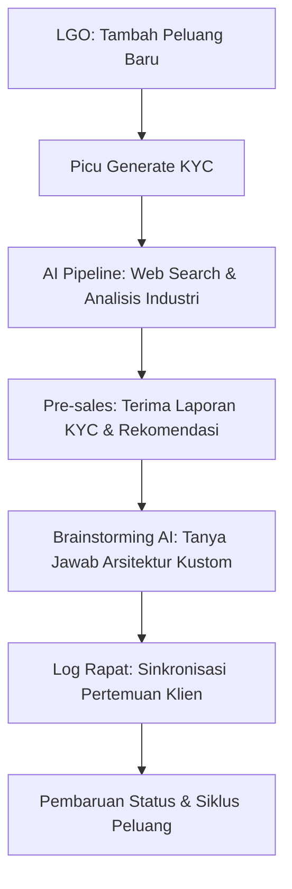

# Panduan Pengguna: Magna Opportunity Intelligence Platform (MOIP)

Selamat datang di **Magna Opportunity Intelligence Platform (MOIP)**. Sistem ini dirancang untuk mendigitalisasi, memperkaya, dan mengotomatisasi kecerdasan peluang pre-sales di PT Smartnet Magna Global (SMG) dengan dukungan kecerdasan buatan (AI) terintegrasi.

---

## 1. Pendahuluan
MOIP berfungsi sebagai jembatan antara identifikasi peluang awal oleh Lead Generation Officer (LGO) dan analisis arsitektur teknis oleh Pre-sales Engineer. 

### Alur Utama Kerja Sistem:

---

## 2. Panduan Antarmuka & Menu Navigasi Utama

Sistem memiliki empat bilah menu utama di sisi kiri layar:

### A. Dashboard Utama
Merupakan halaman pusat pemantauan performa presales yang diperkaya dengan metrik manajemen:
1. **Total Opportunities**: Jumlah keseluruhan peluang pre-sales yang terdaftar dalam database sesuai cakupan peran Anda.
2. **Active Pipelines**: Jumlah peluang aktif yang sedang dalam pengerjaan (mengecualikan status *Won*, *Lost*, dan *On Hold*).
3. **Won Rate (Tingkat Konversi)**: Persentase keberhasilan memenangkan peluang dari seluruh peluang yang telah selesai diproses (`Won` / (`Won` + `Lost`)).
4. **Meetings Today**: Jumlah rapat koordinasi pre-sales yang dijadwalkan hari ini.
5. **KYC Running**: Jumlah laporan riset KYC yang saat ini sedang diproses secara latar belakang oleh sistem.
6. **Need Follow Up**: Jumlah peluang yang membutuhkan tindakan atau tindak lanjut segera.
7. **Visualisasi Analitik**:
   - **Status Distribution**: Grafik lingkaran sebaran status seluruh peluang.
   - **Pipeline Trend**: Tren pendaftaran peluang baru serta status penutupan (Won/Lost) dalam 30 hari terakhir.
   - **Product Distribution**: Grafik sebaran fokus produk solusi yang ditawarkan (misalnya: *Google Cloud Infrastructure*, *Data Analytics & AI*, *Cybersecurity Suite*).
   - **Industry Distribution**: Grafik batang persebaran sektor industri asal pelanggan.

### B. Opportunities
Halaman manajemen seluruh peluang pre-sales.
- **Pencarian & Penyaringan**: Cari peluang berdasarkan nama perusahaan, atau saring berdasarkan status dan engineer penanggung jawab.
- **Tambah Peluang Baru**: Klik **Create Opportunity** di pojok kanan atas, isi Nama Perusahaan, Sektor Industri, Estimasi Nilai Peluang, Target Produk, Kebutuhan Pelanggan, dan Jadwal Rapat Awal.

### C. Meetings
Daftar ringkasan rapat pre-sales global yang dijadwalkan. Memudahkan manajer dan tim memantau agenda sinkronisasi teknis mendatang.

### D. Settings
Halaman konfigurasi personal dan sistem:
1. **User Profile**: Mengubah Nama Lengkap (pembaruan nama akan tercermin di bilah navigasi kiri secara langsung).
2. **AI & Pipeline**: Konfigurasi parameter LLM untuk riset KYC dan Brainstorming (pilihan model LLM dan parameter Temperature). Tersimpan aman di pengaturan lokal browser Anda.
3. **Magna Solutions Catalog**: Daftar katalog produk resmi PT Smartnet Magna Global sebagai referensi arsitektur.
4. **System Operations (Khusus Superadmin)**:
   - Panel khusus untuk pengguna berstatus `superadmin` (seperti akun *Nixon*).
   - Menampilkan ringkasan metrik performa operasional sistem global.
   - **System Activity Logs**: Tabel log audit aktivitas database secara real-time (kapan, siapa, aktivitas apa, dan objek mana yang dimodifikasi).

---

## 3. Sub-Navigasi Halaman Detail Peluang

Setiap peluang memiliki halaman detail khusus yang terbagi ke beberapa bagian informasi penting:

### A. Overview
Menampilkan ringkasan profil pelanggan, detail kontak, engineer yang ditugaskan, dan kebutuhan utama yang dimasukkan oleh LGO.

### B. KYC Report
Laporan analisis kelayakan pelanggan yang diperkaya otomatis oleh AI (Know Your Customer).
- **Progres Bar Interaktif**: Ketika riset KYC baru pertama kali dipicu atau diperbarui, bilah kemajuan real-time akan mengalir memberi tahu tahapan sistem (misalnya: *Menerima data*, *Riset Google Search*, *Menganalisis kompetitor*, hingga *Menyusun rekomendasi*).
- **Hasil Riset**: Berisi rangkuman eksekutif, analisis tantangan industri klien, usulan use case solusi SMG yang tepat guna, serta daftar kompetitor utama klien.

### C. Brainstorming AI (Drawer Kanan)
Bilah panel pintar yang dapat dibuka dari kanan dengan mengklik tombol **Brainstorming AI** di header halaman.
- **Output Streaming**: Jawaban dari asisten AI SMG akan mengalir huruf demi huruf secara langsung sehingga Anda tidak perlu menerka apakah proses pembuatan jawaban sudah selesai.
- **Kustomisasi Dimensi**: Gunakan tombol *Maximize/Minimize* di kanan atas panel obrolan untuk mengubah lebar panel antara mode normal (**400px**) untuk chat ringan dan mode lebar (**650px**) untuk membaca rancangan dokumen proposal atau kode arsitektur yang panjang.
- **Retensi Riwayat**: Riwayat obrolan Anda akan disimpan aman di database dan tidak akan hilang saat Anda berpindah tab. Pesan secara otomatis akan dihapus dalam waktu **7 hari** setelah pembuatan untuk menjaga efisiensi database.

### D. Meetings
Daftar riwayat rapat pre-sales spesifik untuk peluang ini. Gunakan tombol **Log Meeting** di bagian atas untuk mencatat rapat baru beserta tipe rapat (Misalnya: *Internal Sync*, *Client Briefing*, *Technical Presentation*).

### E. Timeline
Jejak audit otomatis yang mencatat setiap peristiwa penting dari peluang tersebut (misalnya: pembuatan peluang, perubahan status, pembaruan laporan KYC, log rapat).

---

## 4. Siklus Hidup Peluang & Panduan Status

Memahami kapan harus memindahkan peluang ke status tertentu sangat penting untuk akurasi data dashboard manajer:

| Status | Deskripsi Status | Kapan Harus Dipilih? |
| :--- | :--- | :--- |
| **New** | Peluang baru didaftarkan ke sistem oleh LGO. | Saat pertama kali data calon pelanggan masuk dan belum dilakukan riset teknis apapun. |
| **KYC Running** | Sistem AI sedang melakukan riset latar belakang terhadap perusahaan klien. | Status ini diatur otomatis oleh sistem saat tombol *Generate KYC* diklik. |
| **Ready Meeting** | KYC berhasil disusun dan siap dipakai oleh tim. | Status otomatis setelah sistem menyelesaikan riset KYC. |
| **Meeting Scheduled** | Tanggal rapat awal presales dengan klien telah disepakati dan dikonfirmasi. | Pilih status ini setelah jadwal rapat awal diisi dan dikonfirmasi oleh klien. |
| **Meeting Done** | Pertemuan perdana atau rapat penyelarasan kebutuhan selesai dilaksanakan. | Ubah ke status ini setelah rapat awal selesai dan hasil rapat dicatat. |
| **Need Proposal** | Pelanggan membutuhkan dokumen proposal teknis atau rancangan arsitektur kustom. | Pilih status ini jika hasil rapat menyimpulkan perlunya rancangan solusi formal. |
| **Negotiation** | Proposal dan penawaran harga sedang ditinjau dan dinegosiasikan oleh pelanggan. | Saat dokumen penawaran harga sudah dikirim ke pelanggan dan sedang dibahas. |
| **PO** | Pelanggan menyetujui proposal dan menerbitkan Purchase Order (PO). | Saat dokumen PO resmi diterima dari pelanggan. |
| **Won** | Kontrak telah ditandatangani dan peluang berhasil dimenangkan. | Pilih status ini untuk menutup peluang dengan kemenangan (kontrak aktif). |
| **Lost** | Pelanggan memutuskan untuk membatalkan atau memilih solusi lain. | Pilih status ini jika peluang gagal dimenangkan. |
| **On Hold** | Proyek atau peluang ditunda sementara oleh pelanggan. | Pilih status ini jika pelanggan menunda pembahasan proyek lebih dari 1 bulan. |
