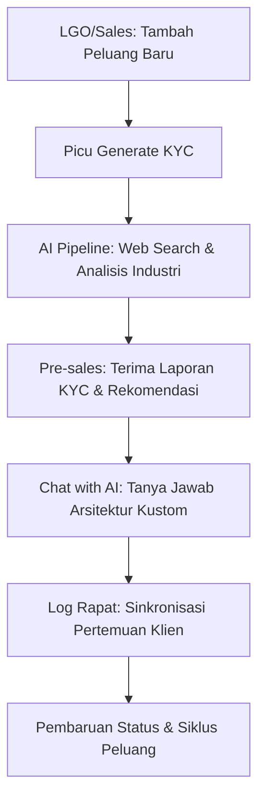

# Panduan Pengguna: Magna Opportunity Intelligence Platform (MOIP)

Selamat datang di **Magna Opportunity Intelligence Platform (MOIP)**. Sistem ini dirancang untuk mendigitalisasi, memperkaya, dan mengotomatisasi kecerdasan peluang pre-sales di PT Smartnet Magna Global (SMG) dengan dukungan kecerdasan buatan (AI) terintegrasi.

---

## 1. Pendahuluan

MOIP berfungsi sebagai jembatan antara identifikasi peluang awal oleh Lead Generation Officer (LGO) dan analisis arsitektur teknis oleh Pre-sales Engineer.

### Alur Utama Kerja Sistem:

---

## 2. Sistem Role & Kapabilitas Akun

MOIP menggunakan sistem dua-lapis: **Role** (tampilan jabatan di sistem) dan **Kapabilitas** (izin aksi nyata di sistem). Super Admin dapat mengatur kedua hal ini secara mandiri dari halaman Settings > User Management.

### Tabel Role & Kapabilitas Default

| Role | Tampilan di Sistem | Kapabilitas Default |
| :--- | :--- | :--- |
| **Viewer** | Viewer Only | View saja |
| **Engineer** | Engineer | View + Generate KYC |
| **Sales** | Sales | View + Create & Edit + Delete + Generate KYC |
| **Presales** | Presales | View + Create & Edit + Delete + Generate KYC |
| **LGO** | LGO | View + Create & Edit + Delete + Generate KYC |
| **Manager** | Manager | View + Create & Edit + Delete + Generate KYC |
| **Super Admin** | Super Admin | Semua kapabilitas + User Management |

### Penjelasan Kapabilitas

| Kapabilitas | Keterangan |
| :--- | :--- |
| **View** | Dapat melihat dashboard, daftar peluang, detail, dan laporan KYC |
| **Create & Edit** | Dapat membuat peluang baru, mengubah data, dan log rapat |
| **Delete** | Dapat menghapus peluang dan rapat |
| **Generate KYC** | Dapat memicu dan me-regenerate laporan KYC AI |
| **User Management** | Dapat mengakses panel manajemen akun pengguna di Settings |

> **Catatan penting**: Role hanya merupakan label identitas di sistem (misalnya "LGO" atau "Manager"). Kapabilitas adalah yang benar-benar menentukan apa yang bisa dilakukan pengguna. Super Admin dapat memberikan kapabilitas apa saja kepada pengguna tanpa perlu mengganti role-nya.

### Pengguna Superadmin Bawaan

Dua akun berikut secara otomatis ditetapkan sebagai Super Admin saat pertama kali login melalui Google OAuth:
- `nixon.hutahaean@magnaglobal.id`
- `robi.firmansyah@magnaglobal.id`

Semua akun lain yang baru pertama kali login akan mendapatkan role **Viewer** dengan kapabilitas View saja, sampai Super Admin mengubahnya.

---

## 3. Panduan Antarmuka & Menu Navigasi Utama

Sistem memiliki empat bilah menu utama di sisi kiri layar:

### A. Dashboard Utama

Merupakan halaman pusat pemantauan performa presales yang diperkaya dengan metrik manajemen:

1. **Total Opportunities**: Jumlah keseluruhan peluang pre-sales yang terdaftar.
2. **Active Pipelines**: Jumlah peluang aktif yang sedang dalam pengerjaan (mengecualikan status *Won*, *Lost*, dan *On Hold*).
3. **Meetings Today**: Jumlah rapat koordinasi pre-sales yang dijadwalkan hari ini.
4. **Need Follow Up**: Jumlah peluang yang membutuhkan tindakan segera.

**Visualisasi Analitik:**
- **Status Distribution**: Grafik lingkaran sebaran status seluruh peluang.
- **Pipeline Trend**: Tren pendaftaran peluang baru dalam 30 hari terakhir.
- **Solution Distribution**: Grafik sebaran fokus **solusi** yang ditawarkan (misalnya: *Google Cloud Infrastructure*, *Data Analytics & AI*, *Cybersecurity Suite*).
- **Industry Distribution**: Grafik batang persebaran sektor industri asal pelanggan.

### B. Opportunities

Halaman manajemen seluruh peluang pre-sales.
- **Pencarian & Penyaringan**: Cari peluang berdasarkan nama perusahaan atau saring berdasarkan status.
- **Tambah Peluang Baru**: Tombol **New Opportunity** hanya muncul bagi pengguna yang memiliki kapabilitas *Create & Edit*. Isi Nama Perusahaan, Sektor Industri, Estimasi Nilai Peluang, Target Solusi, Kebutuhan Pelanggan, dan Jadwal Rapat Awal, lalu klik **Create Opportunity**.

### C. Meetings

Daftar ringkasan rapat pre-sales global. Memudahkan manajer dan tim memantau agenda sinkronisasi teknis mendatang.

### D. Settings

Halaman konfigurasi personal dan sistem:

1. **User Profile**: Mengubah Nama Lengkap.
2. **AI & Pipeline**: Konfigurasi parameter LLM untuk riset KYC (model dan Temperature).
3. **Magna Solutions Catalog**: Daftar katalog produk resmi PT Smartnet Magna Global.
4. **User Management** *(Khusus Super Admin)*: Panel untuk mengelola akses seluruh pengguna (lihat Bagian 4).
5. **System Operations** *(Khusus Super Admin)*: Ringkasan metrik sistem dan log audit aktivitas real-time.

---

## 4. Panel User Management (Khusus Super Admin)

Panel ini tersedia di **Settings → User Management** dan hanya terlihat oleh akun Super Admin.

### Cara Mengubah Akses Pengguna:

1. Buka **Settings** dari menu navigasi kiri.
2. Klik tab **User Management**.
3. Sistem akan memuat daftar seluruh pengguna terdaftar.
4. Klik tombol **Edit Access** pada kartu pengguna yang ingin diubah.
5. **Pilih Role**: Pilih jabatan tampilan pengguna (Viewer, Engineer, Sales, dll.). Memilih role akan secara otomatis menyetel kapabilitas default untuk role tersebut.
6. **Atur Kapabilitas**: Klik toggle kapabilitas (View, Create & Edit, Delete, Generate KYC, User Management) secara individual untuk menyesuaikan izin secara granular, terlepas dari role.
7. **Status Akun**: Toggle on/off untuk mengaktifkan atau menonaktifkan akun pengguna.
8. Klik **Save** untuk menyimpan perubahan.

> Super Admin tidak dapat mengubah role atau menonaktifkan akun mereka sendiri untuk mencegah *lockout* sistem.

---

## 5. Sub-Navigasi Halaman Detail Peluang

Setiap peluang memiliki halaman detail khusus:

### A. Overview

Menampilkan ringkasan profil pelanggan, detail kontak, engineer yang ditugaskan, **Target Solusi**, dan kebutuhan utama.

### B. KYC Report

Laporan analisis kelayakan pelanggan yang diperkaya otomatis oleh AI (Know Your Customer).
- **Progres Bar Interaktif**: Bilah kemajuan real-time memberi tahu tahapan sistem saat KYC diproses.
- **Hasil Riset**: Berisi rangkuman eksekutif, analisis tantangan industri, usulan use case solusi SMG, dan daftar kompetitor.
- **Tombol Regenerate** hanya terlihat bagi pengguna dengan kapabilitas *Generate KYC*.
- **Tombol Edit** hanya terlihat bagi pengguna dengan kapabilitas *Create & Edit*.

### C. Chat with AI (Drawer Kanan)

Bilah panel pintar yang dapat dibuka dengan mengklik tombol **Chat with AI** di header halaman.
- **Output Streaming**: Jawaban AI mengalir secara langsung.
- **Rekomendasi pertanyaan**: Panel menampilkan saran pertanyaan yang relevan di awal sesi. Teks saran yang panjang akan ditampilkan sepenuhnya tanpa terpotong.
- **Kustomisasi Dimensi**: Tombol *Maximize/Minimize* untuk mengubah lebar panel (400px / 650px).
- **Retensi Riwayat**: Riwayat obrolan disimpan di database dan otomatis dihapus setelah 7 hari.

### D. Meetings

Daftar riwayat rapat pre-sales spesifik untuk peluang ini. Tombol **Log Meeting** dan **Add Meeting** hanya terlihat bagi pengguna dengan kapabilitas *Create & Edit*.

### E. Timeline

Jejak audit otomatis yang mencatat setiap peristiwa penting dari peluang tersebut.

---

## 6. Konteks Tambahan untuk AI (Additional Context for AI)

Saat membuat peluang baru, terdapat field **Additional Context for AI**. Field ini bersifat opsional namun sangat berpengaruh pada kualitas laporan KYC yang dihasilkan.

**Cara kerjanya:**  
Teks yang Anda isi di field ini akan disertakan langsung ke dalam **prompt instruksi** yang dikirim ke model LLM saat riset KYC dijalankan. AI akan menggunakannya sebagai titik berat atau konteks khusus — misalnya informasi internal tentang klien, fokus pembahasan yang diinginkan, atau kendala teknis tertentu yang sudah diketahui. Semakin spesifik konteks yang Anda berikan, semakin terarah pula rekomendasi solusi dan use case yang dihasilkan oleh AI.

---

## 7. Siklus Hidup Peluang & Panduan Status

| Status | Deskripsi | Kapan Harus Dipilih? |
| :--- | :--- | :--- |
| **New** | Peluang baru terdaftar. | Saat data calon pelanggan pertama kali masuk. |
| **KYC Running** | Sistem AI sedang melakukan riset. | Status ini diatur otomatis saat *Generate KYC* diklik. |
| **Ready Meeting** | KYC selesai, siap digunakan tim. | Status otomatis setelah riset KYC rampung. |
| **Meeting Scheduled** | Jadwal rapat awal telah dikonfirmasi. | Setelah jadwal rapat dikonfirmasi oleh klien. |
| **Meeting Done** | Rapat perdana selesai dilaksanakan. | Setelah rapat awal selesai dan hasilnya dicatat. |
| **Need Proposal** | Klien membutuhkan proposal teknis. | Jika hasil rapat menyimpulkan perlunya rancangan solusi formal. |
| **Negotiation** | Proposal sedang ditinjau/dinegosiasikan. | Saat penawaran harga sudah dikirim ke klien. |
| **PO** | Klien menerbitkan Purchase Order. | Saat dokumen PO resmi diterima. |
| **Won** | Kontrak ditandatangani, peluang berhasil dimenangkan. | Untuk menutup peluang dengan kemenangan. |
| **Lost** | Klien memilih solusi lain atau membatalkan. | Jika peluang gagal dimenangkan. |
| **On Hold** | Proyek ditunda sementara oleh klien. | Jika klien menunda lebih dari 1 bulan. |
