# Galeri Konsep Desain Logo MOIP

Semua file gambar logo tersimpan di folder ini (`docs/branding/`) dengan gaya **terang, bersih, ramah (human-centric), dan bernuansa modern B2B SaaS**.

---

## 🎯 1. Eksplorasi Huruf "M" Saja (Pure Monogram M)

Jika Anda ingin fokus hanya pada inisial utama **M** sebagai simbol identitas tunggal yang ikonik:

### A. Pure "M" App Icon / Standalone Monogram (Referensi Utama)
*Monogram M minimalis dengan garis kurva membulat biru cobalt & cyan, dipercantik aksen titik cerah coral-pink di kaki kanannya.*

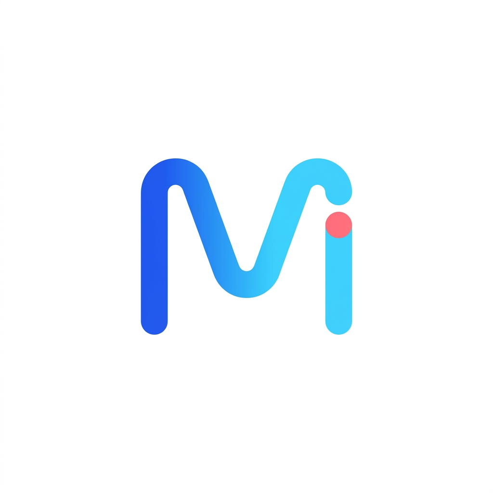

### B. Pure "M" Corporate Lockup
*Simbol M geometris murni di sebelah kiri dengan susunan tipografi modern "MOIP Magna Opportunity Intelligence Platform" di sebelah kanan.*

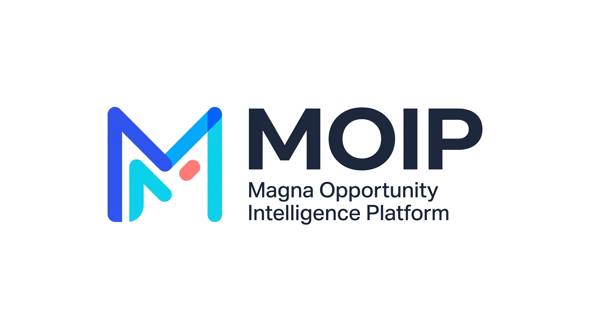

### C. Variasi Vektor Pure "M" (Format SVG Resolusi Tinggi)

| Variasi | Pratinjau | Karakter Visual |
| :--- | :---: | :--- |
| **M-1: Smooth Tubular Flow** | 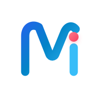 | Rekonstruksi presisi vektor dari referensi: kurva membulat biru-cyan dengan titik beacon magenta (*i-dot*). |
| **M-2: Symmetrical Core** |  | Dua lengkungan simetris biru dan cyan dengan inti lensa aperture magenta terlindungi di lembah tengah M. |
| **M-3: Dynamic Ribbon Fold** | 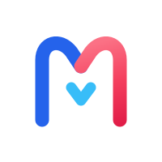 | Garis pita kontinu dari cobalt blue mengalir ke magenta hangat di sayap kanan. |
| **M-4: Precision Rounded M** | 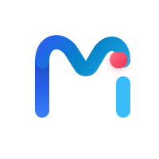 | Pilar monolitik kiri dipadu busur lengkung cyan dan titik radar aperture magenta yang melayang harmonis. |

> 🌐 **Showcase Interaktif:** Buka [`pure-m-showcase.html`](./pure-m-showcase.html) di browser Anda untuk melihat uji ukuran (favicon 24px, app icon 40px, header 64px) dan toggle dark/light mode.

---

## 🚀 2. Eksplorasi Sekalian "MOIP" Lengkap (Full 4-Letter Custom Wordmark)

Jika Anda ingin langsung menampilkan akronim **MOIP** secara utuh di mana setiap huruf mewakili 4 pilar fitur platform:

### Full "MOIP" Bespoke Wordmark
* **M** (Cobalt Blue): *Magna Foundation* (Stabilitas & Trust)
* **O** (Glowing Coral Aperture): *Opportunity Discovery* (Lensa radar presales)
* **i** (Cyan Column): *Intelligence* (Data & AI engine)
* **P** (Indigo Loop): *Platform* (Central hub ekosistem)

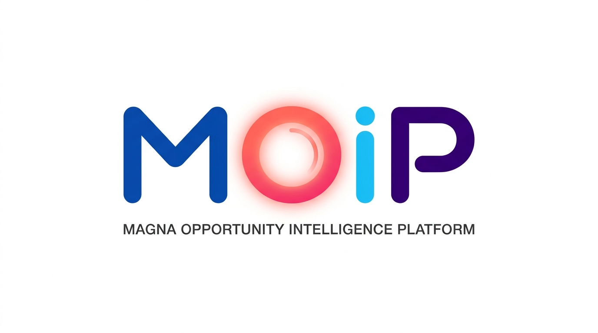

---

## 💡 3. Eksplorasi Gabungan Sebelumnya (Konsep A s/d F)

### Konsep A: Clean Horizontal Lockup
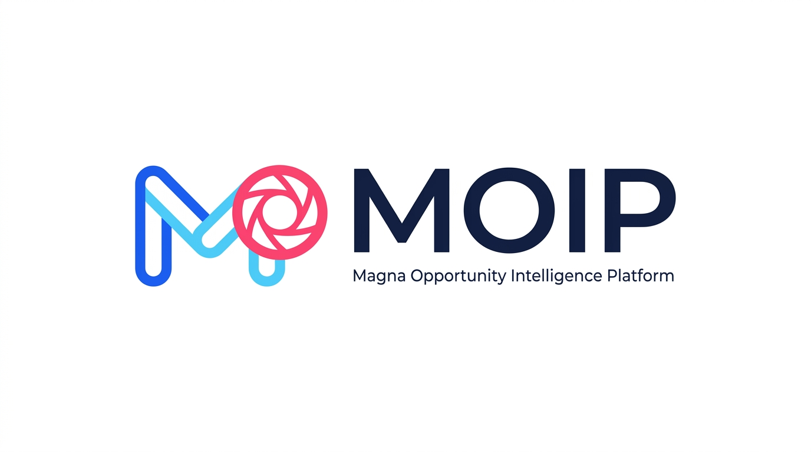

### Konsep B: Fluid Dynamic Monogram
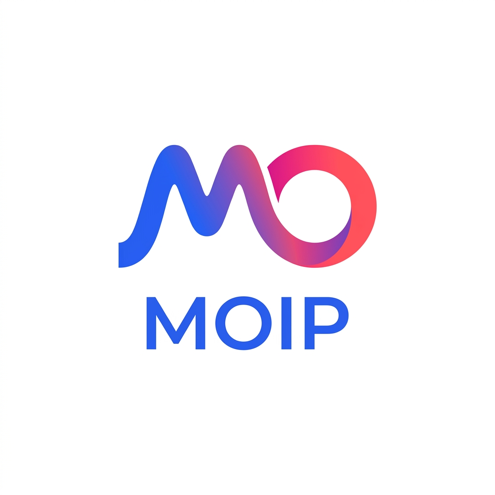

### Konsep C: Continuous Intelligence Infinity Loop
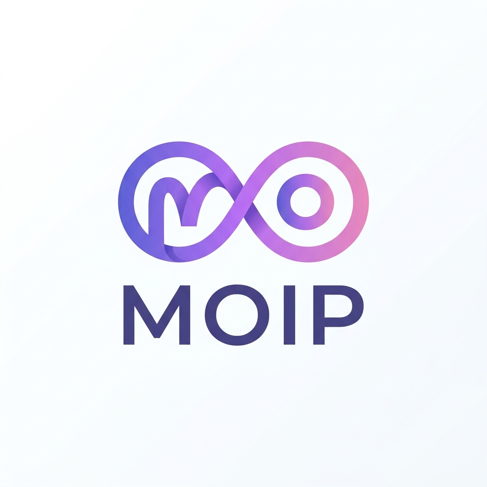

### Konsep D: Overlapping Translucent Lens & Pillars
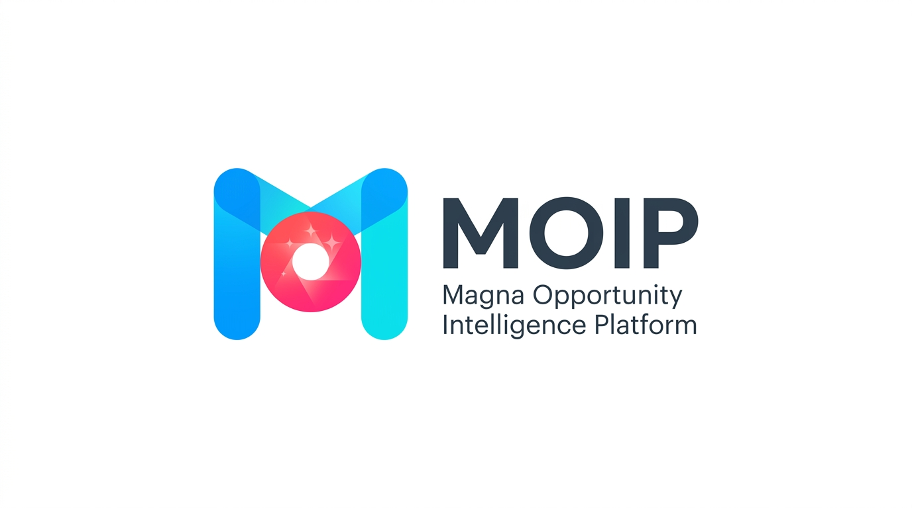

### Konsep E: Dynamic Soft-Flow Ribbon Monogram
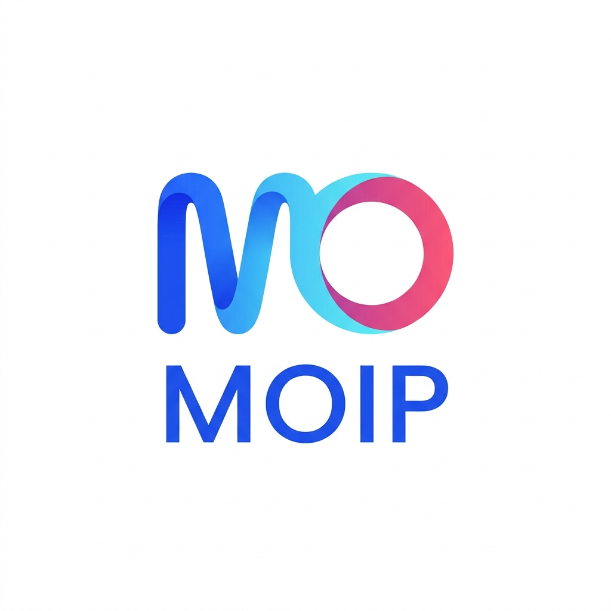

### Konsep F: Geometric Apex Beacon Mark
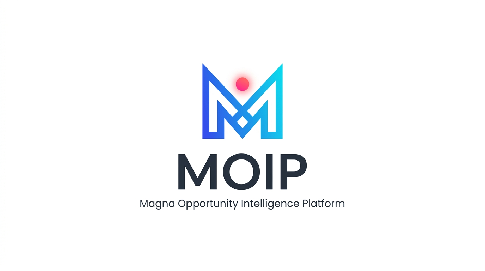